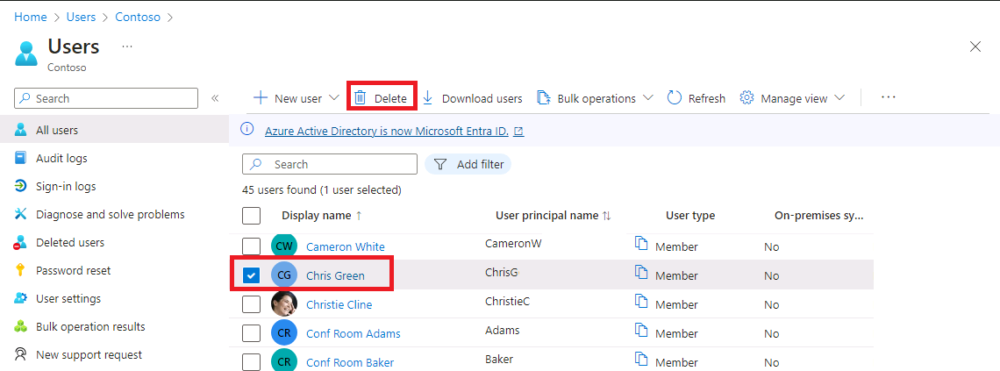

---
lab:
  title: 01 - Administración de roles de usuario
  learning path: '01'
  module: Module 01 - Implement an Identity Management Solution
---

# Inquilinos de WWL: términos de uso
Si se le proporciona un inquilino porque está realizando un curso dirigido por un instructor, tenga en cuenta que ese inquilino está disponible únicamente como apoyo para los laboratorios prácticos del curso. Los inquilinos no deben compartirse ni usarse para otros fines que no sean los de los laboratorios prácticos. El inquilino usado en este curso es un inquilino de prueba y no se puede usar ni tener acceso a él después de que la clase haya terminado y no sea apto para la extensión. Los inquilinos no se deben convertir a suscripciones de pago. Los inquilinos obtenidos como parte de este curso siguen siendo propiedad de Microsoft Corporation y nos reservamos el derecho de acceso y recuperación en cualquier momento. 


# Laboratorio 1: administrar roles de usuario

## Escenario del laboratorio

Tu empresa ha contratado recientemente a un nuevo empleado que realizará tareas como administrador de aplicaciones. Debes crear un nuevo usuario y asignarle el rol adecuado.

#### Tiempo estimado: 30 minutos

### Ejercicio 1: creación de un nuevo usuario y prueba de sus derechos de administrador de aplicaciones

#### Tarea 1: agregar un nuevo usuario

1. Inicia sesión en [https://entra.microsoft.com](https://entra.microsoft.com) como administrador global

2. En el menú de la izquierda, selecciona **Identidad**.

3. En el menú de navegación de la izquierda, en **Usuarios**, selecciona **Todos los usuarios** y después **+ Nuevo usuario** y **Crear nuevo usuario**.

4. Marca el botón **Crear usuario**. Después, crea un usuario con la siguiente información:

    | **Configuración**| **Valor**|
    | :--- | :--- |
    | Nombre principal de usuario| ChrisG|
    | Nombre| Chris Green|

5. Marca la opción **Generar contraseña automáticamente**.

6. Copia la contraseña generada en una ubicación donde puedas recordarla para la siguiente tarea.

     *Tendrás que cambiar la contraseña la primera vez que accedas a esta cuenta*

7. Seleccione **Revisar + crear**. Después, selecciona **Crear** en la pantalla de revisión. Al hacerlo, el usuario se crea y se registra en la organización.

#### Tarea 2: iniciar sesión e intentar crear una aplicación

1. Inicia una nueva ventana del explorador de InPrivate.
2. Abre el Centro de administración de Microsoft Entra [https://entra.microsoft.com](https://entra.microsoft.com) como Chris Green.

    | **Configuración**| **Valor**|
    | :--- | :--- |
    | Nombre de usuario| ChrisG@`your domain name.com`|
    | Contraseña| Escribe la contraseña generada automáticamente de la tarea anterior. |

3. Actualiza tu contraseña.

    | **Configuración**| **Valor**|
    | :--- | :--- |
    | Contraseña actual| Usa una contraseña generada automáticamente|
    | New Password| Escribe una contraseña única y segura |
    | Confirm Password| Vuelve a introducir una contraseña única y segura |

4. Si ves un **diálogo de recorrido**, selecciona el botón **Quizás más tarde**.

5. Busca y selecciona **Aplicaciones empresariales** en el cuadro de diálogo de búsqueda de la parte superior de la pantalla.
7. Selecciona **+ Nueva aplicación**. Ten en cuenta que **+ Crear tu propia aplicación** no está disponible.

9. Prueba seleccionando otras opciones como **Proxy de aplicación**, **Configuración de usuario** y otras para ver si **Chris Green** no tiene derechos.
10. Selecciona el nombre **ChrisG** en la esquina superior derecha y cierra la sesión.


### Ejercicio 2: asignación de rol de administrador de aplicaciones y creación de una aplicación

#### Tarea 1: asignar un rol a un usuario

Con Microsoft Entra ID, puede designar administradores limitados que administren tareas de identidad en roles con menos privilegios. Los administradores se pueden asignar para realizar tareas como agregar usuarios o cambiarlos, asignar roles administrativos, restablecer contraseñas de usuario, administrar licencias de usuario y administrar nombres de dominio.

1. Si aún no has iniciado sesión como Administrador global, abre el Centro de administración de Microsoft Entra e inicia sesión.
2. Ve a Identidad y selecciona la página Usuarios.
3. Selecciona **Todos los usuarios** en la sección Administrar del menú.
4. Selecciona la cuenta de **Chris Green**.
5. Elige **Roles asignados** en el menú Administrar.
6. Selecciona **+ Agregar asignaciones** y marca la función `Application administrator`.
7. Seleccione **Agregar**.

    

**Nota**: si el entorno de laboratorio ya ha activado Microsoft Entra ID Premium P2, se habilitará Privileged Identity Management (PIM) y tendrás que seleccionar **Siguiente** y asignar un Rol permanente a este usuario.

9. Selecciona el botón **Actualizar**.

**Nota: el rol de administrador de aplicaciones recién asignado aparece en la página de roles asignados del usuario.**

#### Tarea 2: comprobar los permisos de la aplicación

1. Inicia una nueva ventana del explorador de InPrivate.
2. Abre el Centro de administración de Microsoft Entra [https://entra.microsoftcom](https://entra.microsoft.com) como Chris Green.

    | **Configuración**| **Valor**|
    | :--- | :--- |
    | Nombre de usuario| ChrisG@`your domain name.com`|
    | Contraseña| Introduce la contraseña única y segura que has creado anteriormente |

3. Si aparece el cuadro de diálogo **Le damos la bienvenida a Microsoft Azure**, selecciona el botón **Quizás más tarde**.
4. Busca y selecciona **Aplicaciones empresariales** en el cuadro de diálogo de búsqueda en la parte superior de la pantalla.
5. Observa que **+ Nueva aplicación** está disponible ahora.
6. Selecciona **+ Nueva aplicación**
7. Observa que **"**+ Crea tu propia aplicación** no está en gris. Si eliges una aplicación de la galería, verás que el botón **Crear** está disponible.

   **Nota: este rol tiene ahora la capacidad de añadir aplicaciones al inquilino. Experimentaremos más con esta característica en laboratorios posteriores.**

7. Cierre la sesión de la instancia de Chris Green del portal y cierre el explorador.

### Ejercicio 3: eliminación de una asignación de roles

#### Tarea 1: eliminar el administrador de aplicaciones de Chris Green

Esta tarea usará un método alternativo para quitar el rol asignado; usará la opción **Roles y administradores** en Micrisoft Entra ID.

1. Si aún no has iniciado sesión como tu Administrador global, inicia el Centro de administración de Microsoft Entra e inicia sesión ahora.
2. En el cuadro de búsqueda, escribe **Roles** y después inicia los roles y la administración de Microsoft Entra ID.
3. En  **Todos los roles** de  **Roles y administradores**, selecciona el rol **Administrador de aplicaciones** de la lista.
4. En la página **Administrador de aplicaciones | Asignaciones** deberías ver el nombre Chris Green en la lista.
5. Coloca una marca de verificación en el cuadro junto a Chris Green.
6. Selecciona **X Quitar asignaciones** de las opciones de la parte superior del cuadro de diálogo.
7. Responde **Sí** cuando se abra el cuadro de confirmación.
8. Cierra la pantalla.

### Ejercicio 4: importación masiva de usuarios

#### Tarea 1: operaciones masivas para crear usuarios con un archivo .csv

1. En el menú de Microsoft Entra ID, abre primero **Identidad**, selecciona después **Usuarios** y selecciona a continuación **Todos los usuarios**.

2. En el mosaico **Usuarios | Todos los usuarios**, selecciona la flecha desplegable **Operaciones masivas** y después **Crear de forma masiva**.

3. Al seleccionar **Creación masiva** se abrirá un nuevo mosaico. Este mosaico proporciona un vínculo de **descarga** de un archivo de plantilla que editarás para rellenar con la información del usuario y cargar para agregar la creación masiva de usuarios.

4. Selecciona **Descargar** para descargar el archivo .csv.

5. La plantilla .csv te proporciona los campos incluidos con el perfil de usuario. Esto incluye el nombre de usuario, el nombre para mostrar y la contraseña inicial obligatorios. También puede completar campos opcionales, como Ubicación y uso del departamento, en este momento. La captura de pantalla siguiente es un ejemplo de cómo puedes completar el archivo .csv: 

    

    Puedes modificar este archivo para agregar usuarios de forma masiva.  Observa que no es necesario rellenar todo el campo.  Según los datos de ejemplo proporcionados, debes agregar principalmente el nombre y la información de nombre de usuario.

6. Se ha proporcionado un CSV de ejemplo en la carpeta Allfiles/Lab1 -- **SC300BulkUser.csv**.
   1. Abra Bloc de notas.
     - Dentro del entorno de laboratorio, selecciona el botón INICIAR y escriba Bloc de notas.  
   1. Abre el archivo SC300BulkUser.csv
   1. Cambia el valor de **escriba el nombre de dominio** en el dominio de tu entorno de laboratorio de Azure.
   1. Guarde el archivo.

7. En el diálogo **Creación masiva de usuarios**, selecciona el icono de carpeta de archivos del paso 3.

8. Accede mediante la ruta de acceso a la carpeta Allfiles/Lab1 y selecciona el archivo **SC300BulkUser.csv**.

9. Seleccione **Open** (Abrir).

7. Se te notificará que el archivo se ha cargado correctamente.Elige **Enviar** para agregar los usuarios. 

Una vez creados los usuarios, se te comunicará que la creación se ha realizado correctamente.  Cierra el icono Creación masiva de usuarios y los nuevos usuarios se rellenarán en la lista **Usuarios | Todos los usuarios**. 

#### Tarea 2: agregar usuarios de manera masiva con PowerShell

1. Abra PowerShell como administrador.Para ello, busca PowerShell en Windows y elige Ejecutar como administrador. 

**Nota:** Debes tener PowerShell versión 7.2 o posterior para que este laboratorio funcione.  Cuando se abra PowerShell, verás una versión en la parte superior de la pantalla. Si ejecutas una versión anterior, sigue las instrucciones de la pantalla para ir a https://aka.ms/PowerShell-Release?tag=7.3.9. Desplázate hacia abajo hasta la sección activos y selecciona powershell-7.3.1-win-x64.msi. Cuando se haya completado la descarga, selecciona Abrir archivo. Instala con todos los valores predeterminados.

2. Deberás instalar el módulo de PowerShell Microsoft.Graph si no lo has usado antes.  Ejecuta los dos comandos siguientes y cuando se te pida confirmación pulsa Y:

    ```
    Install-Module Microsoft.Graph
    ```
3. Confirma que el módulo Microsoft.Graph está instalado:

    ```
    Get-InstalledModule Microsoft.Graph
    ```
    

4. Después deberás iniciar sesión en Azure mediante la ejecución de:  

    ```
    Connect-MgGraph -Scopes "User.ReadWrite.All"
    ``` 
    Se abrirá el explorador Edge y se te pedirá que inicies sesión.  Usa la cuenta de administrador MOD para conectarte.  Acepta la solicitud de permisos y cierra la ventana del explorador.

5. Para verificar que tienes conexión y ver los usuarios existentes, ejecuta:  

    ``` 
    Get-MgUser 
    ```
    
7. Para asignar una contraseña temporal común a todos los usuarios nuevos, ejecuta el siguiente comando y reemplaza <Enter a complex Password> por la contraseña que quieras proporcionar a tus usuarios.  

    ``` 
    $PWProfile = @{
        Password = "<Enter a complex password you will>";
        ForceChangePasswordNextSignIn = $false
    }
    ```

8. Ya puedes crear un nuevo usuario.  El comando siguiente se rellenará con la información del usuario y se ejecutará.  Si tienes más de un usuario que agregar, puedes usar un archivo TXT de Bloc de notas para agregar la información del usuario y copiar o pegar en PowerShell. 

    ```
    New-MgUser `
        -DisplayName "New PW User" `
        -GivenName "New" -Surname "User" `
        -MailNickname "newuser" `
        -UsageLocation "US" `
        -UserPrincipalName "newuser@<labtenantname.com>" `
        -PasswordProfile $PWProfile -AccountEnabled `
        -Department "Research" -JobTitle "Trainer"
    ```
**Nota**: reemplaza **labtenantname.com** por el nombre de **onmicrosoft.com** asignado por el inquilino del laboratorio.

## Experimentar con la administración de usuarios

Puedes agregar y quitar usuarios con la página Microsoft Entra ID.  Sin embargo, los usuarios se pueden crear y los roles se pueden asignar mediante el scripting.  Experimenta con dar a la cuenta de usuario de Chris Green un rol diferente con script. 
 

### Ejercicio 5: eliminar un usuario de Microsoft Entra ID

#### Tarea 1: quitar un usuario

Puede ocurrir que se elimine una cuenta y después se deba recuperar. Debes comprobar que puedes recuperar una cuenta que se ha eliminado recientemente.

1. Vaya a [https://entra.micrososft.com](Microsoft Entra admin center).

2. En el panel de navegación izquierdo, en **Identidad**, seleccione **Usuarios**.

3. Abre la lista **Todos los usuarios**, selecciona la casilla del usuario que se va a eliminar. Por ejemplo, seleccione **Chris Green**.

    **Sugerencia**: seleccionar usuarios de la lista te permite administrar varios usuarios al mismo tiempo. Si selecciona un usuario y desea abrir la página de ese usuario, solo administrará a ese usuario.

    

4. Con la cuenta de usuario seleccionada, en el menú, selecciona **Eliminar**.

5. Revisa el cuadro de diálogo y luego selecciona **Sí**.

#### Tarea 2: restaurar un usuario eliminado

1. En la página Usuarios, selecciona **Todos los usuarios** en la navegación de la izquierda, selecciona **Usuarios eliminados**.

2. Revisa la lista de usuarios eliminados y selecciona **Chris Green**.

    **Importante**: de manera predeterminada, las cuentas de usuario eliminadas se quitan permanentemente de Azure Active Directory de manera automática después de 30 días.

3. En el menú, seleccione **Restaurar usuario**.

4. Revise el cuadro de diálogo y, luego, seleccione **Aceptar**.

5. En el menú de navegación izquierdo, seleccione **Todos los usuarios**.

6. Compruebe que se restauró el usuario.


### Ejercicio 6: agregar una licencia de Windows 10 a una cuenta de usuario

#### Tarea 1: buscar el usuario sin licencia en Azure Active Directory

Algunas cuentas de usuario de su organización no recibirán todos los productos disponibles en su licencia asignada o necesitarán actualizaciones o adiciones a su asignación de licencias. Debes asegurarte de que puedes actualizar la asignación de licencias de una cuenta de usuario en Azure AD.

1. Vaya a [https://entra.microsoft.com]( https://entra.microsoft.com).

2. En la navegación de la izquierda, en **Identidad**, selecciona **Usuarios** y después selecciona **Todos los usuarios**.

3. En la página Usuarios, escribe **Raul** en el cuadro de búsqueda.

4. Selecciona **Raul Razo**.

5. Revisa el perfil de Azure y asegúrate de que tiene la Ubicación de uso establecida.

    **Advertencia**: para asignar una licencia a un usuario, el usuario debe tener asignada una ubicación de uso.

6. Selecciona la opción **Licencias** del menú de la izquierda.

7. Asegúrate de que Raul tiene "No se han encontrado asignaciones de licencia".

8. Vuelve a **Todos los usuarios** en el menú de la izquierda, en **Identidad**, y selecciona **Usuarios**.

9. En la página Usuarios, selecciona **Raul Razo**.

10. En el panel de navegación izquierdo, seleccione **Licencias.**

11. Selecciona el botón **+ Asignaciones**. 

12. En la página Actualizar asignaciones de licencias, activa la casilla de una licencia de **Windows 10/11 Enterprise E3**.

    

13. Cuando haya terminado, seleccione **Guardar**.

14. En la parte superior de la pantalla, selecciona **Inicio**, luego selecciona **Contoso**, **Usuario** y, finalmente, **Raul Razo**.

15. Observa que se ha asignado la licencia.
