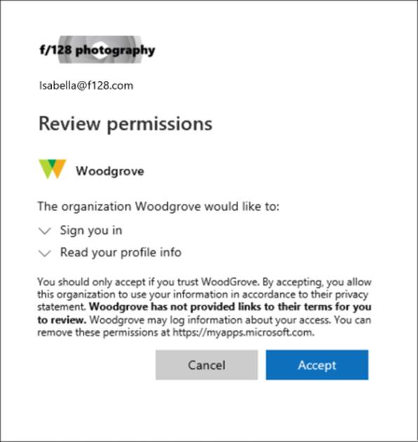

---
lab:
  title: '02: trabajar con propiedades de inquilino'
  learning path: '01'
  module: Module 01 - Implement an Identity Management Solution
---

# Laboratorio 02: trabajo con propiedades de inquilino

## Escenario del laboratorio

Debes identificar y actualizar las distintas propiedades asociadas a tu inquilino.

#### Tiempo estimado: 15 minutos

### Ejercicio 1: creación de un subdominio personalizado 

#### Tarea 1: crear un nombre de subdominio personalizado

1. Ve a [https://portal.azure.com](https://portal.azure.com) e inicia sesión con una cuenta de administrador global para el directorio.

1. Seleccione el icono de hamburguesa del **menú Mostrar portal** y, a continuación, seleccione **Azure Active Directory**.

    

1. En la sección **Administrar** de **Azure AD**, selecciona **Nombres de dominio personalizados**.

1. Seleccione **Agregar dominio personalizado**.

1. En el campo **Nombre de dominio personalizado**, crea un subdominio personalizado para el inquilino de laboratorio y pon **ventas** delante del nombre de dominio **onmicrosoft.com**.  El formato será similar al siguiente:

    ```
    sales.labtenant.onmicrosoft.com
    ```

1. Selecciona **Agregar dominio** para agregar el subdominio.


### Ejercicio 2: cambiar el nombre para mostrar el del inquilino

#### Tarea 1: establecer el nombre del inquilino y el contacto técnico

1. En Azure Active Directory, en la navegación izquierda, en la sección **Administrar**, selecciona **Propiedades**.

1. Cambia las propiedades del inquilino para el **Nombre** y el **Contacto técnico** en el cuadro de diálogo.

    | **Configuración** | **Valor** |
    | :--- | :--- |
    | Nombre | Contoso marketing |
    | Contacto técnico | `your Global admin account` |

1. Seleccione **Guardar** para actualizar las propiedades del inquilino.

   **Verás que el nombre cambia inmediatamente después de la finalización del guardado.**

#### Tarea 2: revisar el país o región y otros valores asociados a tu inquilino

1. En la página **Azure Active Directory**, en la sección Administrar, selecciona **Propiedades**.

2. En **Propiedades de inquilino**, busque **País o región** y revise la información.

    **IMPORTANTE**: el país o la región se especifican cuando se crea el inquilino. Esta configuración no puede modificarse más tarde.

3. En la pantalla **Propiedades**, en **Propiedades del inquilino**, localiza **Ubicación** y revisa la información.

    

#### Tarea 3: buscar el Id. de inquilino

Las suscripciones de Azure tienen una relación de confianza con Azure Active Directory (Azure AD). Se confía en Azure AD para autenticar usuarios, servicios y dispositivos de la suscripción. Cada suscripción tiene un identificador de inquilino asociado y hay varias maneras de encontrarlo.

1. En la página **Azure Active Directory**, en la sección Administrar, selecciona **Propiedades**.

2. En **Propiedades de inquilino**, busque **Identificador de inquilino**. Este es el identificador único de inquilino.

    

### Ejercicio 3: configuración de la información de privacidad

#### Tarea 1: agregar la información de privacidad en Azure AD, incluyendo el contacto de privacidad global y la dirección URL de declaración de privacidad

Microsoft recomienda agregar su contacto de privacidad global y la declaración de privacidad de su organización, de modo que los empleados internos e invitados externos puedan revisar las directivas. Dado que las declaraciones de privacidad se crean de forma única y específica para cada negocio, es recomendable ponerse en contacto con un abogado para obtener ayuda.

   **NOTA**: para obtener información sobre cómo ver o eliminar datos personales, consulta [https://docs.microsoft.com/microsoft-365/compliance/gdpr-dsr-azure](https://docs.microsoft.com/microsoft-365/compliance/gdpr-dsr-azure). Para obtener más información acerca de RGPD, consulta [https://servicetrust.microsoft.com/ViewPage/GDPRGetStarted](https://servicetrust.microsoft.com/ViewPage/GDPRGetStarted).

Puedes agregar información de privacidad de tu organización en el área de  **Properties**  de Azure AD. Para acceder al área de propiedades y agregar la información de privacidad:

1. En la página **Azure Active Directory**, en la sección Administrar, selecciona **Propiedades**.

    

2. Agregar la información de privacidad de sus empleados:

- **Contacto de privacidad global** - `AllanD@`**tu dominio del laboratorio de Azure**
     - Allan Deyoung es un usuario integrado en el inquilino del laboratorio de Azure que trabaja como un administrador de TI, lo usaremos como contacto de privacidad.
     - Esta persona también es quien se pone en contacto con Microsoft si se produce una vulneración de datos. Si no aparece ninguna persona aquí, Microsoft se pone en contacto con los administradores globales.

- **URL de la declaración de privacidad** -  <https://github.com/MicrosoftLearning/SC-300-Identity-and-Access-Administrator/blob/master/Allfiles/Labs/Lab2/SC-300-Lab_ContosoPrivacySample.pdf>

     - El archivo PDF de privacidad de muestra se proporciona en tu directorio de laboratorios.
     - Escribe el vínculo al documento de tu organización que describe cómo administra tu organización la privacidad de los datos de los huéspedes internos y externos.

    **IMPORTANTE**: si no incluyes ni tu propia declaración de privacidad ni tu contacto de privacidad, tus invitados externos verán el texto en el cuadro Permisos de revisión que dice,  **nombre de tu organización\>** no ha proporcionado vínculos a sus términos que pueda revisar. Por ejemplo, un usuario invitado verá este mensaje cuando reciba una invitación para acceder a una organización a través de la colaboración B2B.

    

3. Seleccione **Guardar**.

#### Tarea 2: comprobar tu declaración de privacidad

1. Vuelve a la pantalla principal de Azure: panel.
2. En la esquina superior derecha de la interfaz de usuario, selecciona tu nombre de usuario.
3. Elige **Ver cuenta** en el menú desplegable.

     **Se abrirá una nueva pestaña del explorador automáticamente.**

4. Selecciona **Configuración y privacidad** en el menú de la izquierda.
5. Seleccione **Privacidad**.
6. En **Aviso de la organización** selecciona el elemento **Ver** junto a Declaración de privacidad de la organización Contoso Marketing.

     **Se abrirá una nueva pestaña del explorador con el archivo PDF de privacidad que has vinculado para mostrar.**

7. Revisa la declaración de privacidad de muestra.
8. Cierra la pestaña del explorador con el PDF.
9. Cierra la pestaña del explorador donde se muestran los elementos de **Mi cuenta**.
