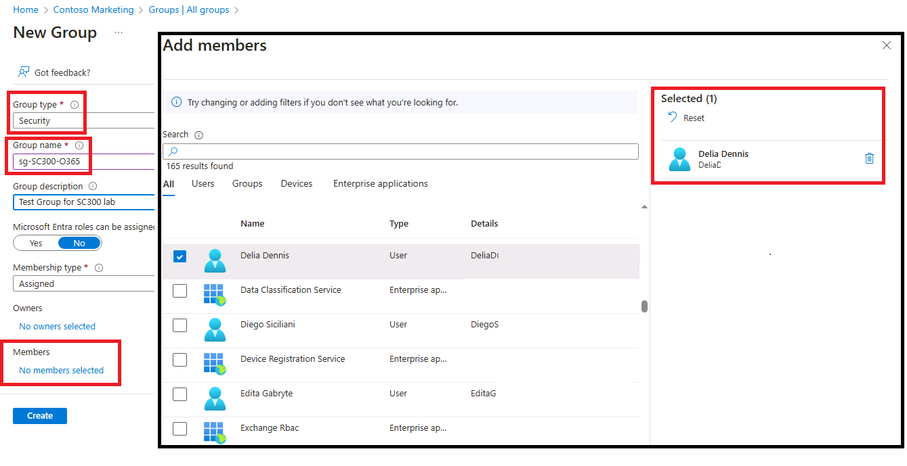

---
lab:
  title: '03: asignar licencias con la pertenencia a grupos'
  learning path: '01'
  module: Module 01 - Implement an identity management solution
---

# Laboratorio 03: Asignar licencias mediante la pertenencia a grupos

## Escenario del laboratorio

Tu organización ha decidido usar grupos de seguridad en Microsoft Entra ID para administrar licencias. Debes configurar un nuevo grupo de seguridad y asignar una licencia a ese grupo y comprobar que se han actualizado las licencias de miembro del grupo.

#### Tiempo estimado: 25 minutos

### Ejercicio 1: crear un grupo de seguridad y añadir un usuario

#### Tarea 1: comprobar si Delia Dennis tiene acceso a Office 365

1. Inicia una nueva ventana del explorador InPrivate.
2. Conectarse a [https://www.office.com](https://www.office.com).
3. Selecciona Iniciar sesión y conéctate como Delia Dennis.

   | **Configuración**| **Valor**|
   | :--- | :--- |
   | Nombre de usuario | DeliaD@`your domain name.com`|
   | Contraseña| Escribe la contraseña del Administrador global de los recursos.|

4. Debes conectarte al sitio web de Office.com, pero verás un mensaje que indica que no tienes una licencia.

   
    
5. Cierre la ventana del explorador.

#### Tarea 2: crear un grupo de seguridad en Microsoft Entra ID

1. Vaya a [https://entra.microsoft.com](https://entra.microsoft.com).

2. En la navegación de la izquierda, en **Identidad**, selecciona **Grupos** y después **Todos los grupos**.
3. En la página Grupos, en el menú, selecciona **Nuevo grupo**.
4. Cree un grupo con esta información:

   | **Configuración**| **Valor**|
   | :--- | :--- |
   | Tipo de grupo| Seguridad|
   | Nombre del grupo| sg-SC300-O365|
   | Tipo de pertenencia| Asignada|
   | Propietarios| *Asigna tu propia cuenta de administrador como propietario del grupo*|

5. Selecciona el texto **Sin miembros seleccionados** en Miembros.
6. Selecciona **Delia Dennis** de la lista de usuarios.
7. Seleccione el botón **Seleccionar**.

   

8. Seleccione el botón **Crear**.
9. Cuando termines, comprueba que el grupo denominado **sg-SC300-O365** aparece en la lista **Todos los grupos**.

#### Tarea 3: asignar una licencia a un grupo

1. En la lista **Todos los grupos**, selecciona **sg-SC300-O365**.
2. En la ventana Marketing, en **Administrar**, selecciona **Licencias**.
3. En el menú, selecciona **+ Asignaciones**.
4. En Actualizar asignaciones de licencia, en **Seleccionar licencias**, revisa la lista de licencias disponibles y después selecciona la casilla de verificación de **Office 365 E3**.

   **Sugerencia**: cuando se seleccionan varias licencias, puedes usar el menú de opciones de Revisar licencia para seleccionar una licencia específica y ver la opción de licencia para esta.

   

6. Seleccione **Guardar**.

#### Tarea 4: confirmar la licencia de Office 365

1. Inicia una nueva ventana del explorador InPrivate.
2. Conectarse a [https://www.office.com](https://www.office.com).
3. Selecciona Iniciar sesión y conéctate como Delia Dennis.

   | **Configuración**| **Valor**|
   | :--- | :--- |
   | Nombre de usuario | DeliaD@`your domain name.com`|
   | Contraseña| Escribe la contraseña del Administrador global de los recursos.|

4. Debes conectarte al sitio web de Office.com y no ver ningún mensaje con respecto a la licencia. Todas las aplicación de Office están disponibles a la izquierda.

   
    
5. Cierre la ventana del explorador. 

### Ejercicio 2: Crear un grupo de Microsoft 365 en Microsoft Entra ID

#### Tarea 1: crear el grupo

Parte de tus tareas como administrador de Microsoft Entra es crear diferentes tipos de grupos. Debes crear un nuevo grupo de Microsoft 365 para el departamento de ventas de tu organización.

1. Vaya a [https://entra.microsoft.com]( https://entra.microsoft.com).

2. En la navegación de la izquierda, en **Identidad**, selecciona **Grupos** y después selecciona **Todos los grupos**

3. En la página Grupos, en el menú, selecciona **Nuevo grupo**.

4. Cree un grupo con esta información:

   | **Configuración**| **Valor**|
   | :--- | :--- |
   | Tipo de grupo| Microsoft 365|
   | Nombre del grupo| Northwest Sales|
   | Tipo de pertenencia| Asignada|
   | Propietarios| *Asigna tu propia cuenta de administrador como propietario del grupo*|
   | Miembros| **Alex Wilber** y **Bianca Pisani**|

   

5. Cuando termine, compruebe que el grupo denominado **Northwest Sales** aparece en la lista **Todos los grupos**.

### Ejercicio 3: crea un grupo dinámico con todos los usuarios como miembros

#### Tarea 1: crear el grupo dinámico

A medida que crece tu empresa, la administración manual de grupos se hace demasiado lenta. Desde la estandarización del directorio, puedes sacar partido a los grupos dinámicos. Debes crear un nuevo grupo dinámico para asegurarte de que esté todo listo para la creación de grupos dinámicos en producción.

1. Inicia sesión en [https://entra.microsoft.com](https://entra.microsoft.com) con una cuenta que tenga asignada el rol Administrador global o Administrador de usuarios en el inquilino.

2. Seleccione **Identidad**.

3. En **Grupos**, selecciona **Todos los grupos** y después selecciona **Nuevo grupo**.

4. En la página Nuevo grupo, en **Tipo de grupo**, seleccione **Seguridad**.

5. En el cuadro del **Nombre del grupo**, escribe **SC300-myDynamicGroup**.

6. Seleccione el menú **Tipo de pertenencia** y, luego, seleccione **Usuario dinámico**.

7. Selecciona un **Propietario** para el grupo.

7. En **Dynamic user members** (Miembros usuarios dinámicos), seleccione **Add dynamic query** (Agregar consulta dinámica).

8. A la derecha, sobre el cuadro **Sintaxis de regla**, seleccione **Editar**.

9. En el panel de edición de sintaxis de regla, escriba esta expresión en el cuadro **Sintaxis de regla**:

   ```powershell
   user.objectid -ne null
   ```

   **Advertencia:** el `user.objectid` distingue mayúsculas de minúsculas.

10. Seleccione **Aceptar**. La regla aparece en el cuadro Sintaxis de regla.

   

11. Seleccione **Guardar**. En el nuevo grupo dinámico se incluirán ahora los usuarios invitados de B2B y los usuarios miembros.

12. En la página Nuevo grupo, seleccione **Crear** para crear el grupo.

#### Tarea 2: comprobar que se han agregado los miembros

**Nota:** el rellenado de pertenencia dinámica a grupos puede tardar hasta 15 minutos.

1. Selecciona **Inicio**`Microsoft Entra admin center`.
2. Inicia **Identidad**.
3. En el menú **Grupos**, selecciona **Todos los grupos**.
4. En el cuadro de filtro, escribe **SC300** y se mostrará el grupo recién creado.
5. Selecciona **SC300-myDynamicGroup** para abrir el grupo.
6. Observa que muestra que contiene más de 30 **miembros directos*.
7. Selecciona **Miembros** en el menú **Administrar**.
8. Revisa los miembros.

#### Tarea 3: experimentar con reglas alternativas

1. Prueba a crear un grupo solo con usuarios **Invitados**:

   - (user.objectid -ne null) y (user.userType -eq "Guest")

2. Prueba a crear un grupo solo con **miembros** de los usuarios de Microsoft Entra.

   - (user.objectid -ne null) y (user.userType -eq "Member")
