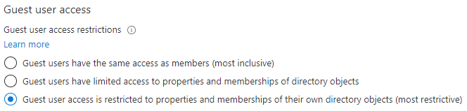

---
lab:
  title: '04: configurar valores de colaboración externa'
  learning path: '01'
  module: Module 01 - Implement an identity management solution
---

# Laboratorio 04: configurar valores de colaboración externa

## Escenario del laboratorio

Debes habilitar la configuración de colaboración externa para que accedan invitados aprobados a tu organización.

#### Tiempo estimado: 5 minutos

### Ejercicio 1: permitir que se inviten usuarios invitados a tu organización

#### Tarea 1: permitir que los usuarios invitados realicen el registro de autoservicio

1. Inicia sesión en  [https://entra.microsoft.com](https://entra.microsoft.com)  como administrador de inquilinos.
2. Selecciona **Identidad** y después **Usuarios**.
3. Abre el elemento de menú **Todos los usuarios** y selecciona **Configuración de usuario**.
4. Selecciona **Administrar la configuración de colaboración externa**.
5. Asegúrate de que **Sí** está marcado para la configuración **Habilitar el registro de autoservicio de invitado a través de flujos de usuarios**.
6. En la parte superior de la pantalla, seleccione **Guardar**.

#### Tarea 2: configurar valores de colaboración externa

1. Inicia sesión en  [https://entra.microsoft.com](https://entra.microsoft.com)  como administrador de inquilinos.
2. Selecciona **Identidad**.
3. Selecciona  **Identidades externas** y después selecciona **Todos los proveedores de identidades**.
4. Selecciona el vínculo de notificación del **código de acceso de un solo uso por correo electrónico** que verás cerca de la parte superior de la pantalla.

    **Nota:** Un código de acceso de un solo uso es una manera muy segura de invitar a un usuario a unirse a tu organización.
    
5. Asegúrese de que está seleccionada la opción **Sí**.
6. Si es necesario, selecciona **Guardar**.
7. De lo contrario, selecciona `Home > Contoso Marketing >`**Identidades externas** para volver a la pantalla anterior.
8. Selecciona **Configuración de colaboración externa** a la izquierda.

9. En  **Acceso de usuario invitado**, revisa los niveles de acceso disponibles y, luego, selecciona **El acceso de los usuarios invitados está restringido a las propiedades y pertenencias de sus propios objetos de directorio (lo más restrictivo)**.

    **NOTA**
    - Los usuarios invitados tienen el mismo acceso que los miembros (principalmente inclusivo): Esta opción permite a los invitados tener el mismo acceso a los recursos de Microsoft Entra y a los datos del directorio que los usuarios miembros.
    - Guest users have limited access to properties and memberships of directory objects (Los usuarios invitados tienen acceso limitado a las propiedades y pertenencias de los objetos de directorio): (predeterminada) Esta opción impide que los usuarios realicen determinadas tareas de directorio, como enumerar usuarios, grupos u otros recursos de directorio. Los invitados pueden ver la pertenencia de todos los grupos no ocultos.
    - Guest user access is restricted to properties and memberships of their own directory objects (most restrictive) (El acceso de los usuarios invitados está restringido a las propiedades y pertenencias de sus propios objetos de directorio [opción más restrictiva]): con esta configuración, los invitados solo pueden tener acceso a sus propios perfiles. No se permite a los invitados ver perfiles, grupos o pertenencias a grupos de otros usuarios.

    

10. En  **Configuración de invitación de invitados**, selecciona **Los usuarios miembros y los asignados a roles específicos de administrador pueden invitar a usuarios invitados, incluyendo invitados con permisos de miembro**

    **NOTA**
    - Cualquier persona de la organización puede invitar a usuarios, incluidos los invitados y los usuarios que no son administradores (esta es la opción más inclusiva): para permitir que los invitados de la organización inviten a otros invitados, incluidos aquellos que no son miembros de una organización, seleccione este botón de radio.
    - Los usuarios miembros y los usuarios asignados a roles de administrador específicos pueden invitar a usuarios, incluidos aquellos con permisos de miembro: para permitir que los usuarios miembros y los usuarios que tienen roles de administrador específicos inviten a invitados, seleccione este botón de radio.
    - Solo los usuarios asignados a roles de administrador específicos pueden invitar a otros usuarios: para permitir que solo los usuarios con roles de administrador inviten a invitados, seleccione este botón de radio. Los roles de administrador incluyen Administrador global, Administrador de usuarios e Invitador de usuarios invitados.
    - Nadie de la organización puede invitar a usuarios, ni siquiera los administradores (esta es la opción más restrictiva) : para denegar a todos los usuarios de la organización la invitación de invitados, seleccione este botón de radio.
    - Si Los miembros pueden invitar está establecido en No y Los administradores y los usuarios del rol de invitador de personas pueden invitar está establecido en Sí, los usuarios del rol Invitador de usuarios invitados todavía podrán invitar a usuarios invitados.

    

11. En  **Restricciones de colaboración**, revisa las opciones disponibles y acepta la configuración predeterminada.

    **IMPORTANTE**
    - Puede crear una lista de permitidos o una lista de denegación. No se pueden configurar ambos tipos de listas. De forma predeterminada, los dominios que no están en la lista de permitidos están en la de denegación y viceversa.
    - Solo puede crear una directiva por organización. Puede actualizar la directiva para incluir más dominios, o puede eliminar la directiva para crear una nueva.
    - El número de dominios que puede agregar a una lista de permitidos o de denegación solo se ve limitado por el tamaño de la directiva. El tamaño máximo de toda la directiva es de 25 KB (25 000 caracteres), que incluye la lista de permitidos o la lista de denegación y cualquier otro parámetro configurado para otras características.
    - Esta lista funciona con independencia de las listas de permitidos o bloqueados de OneDrive para la Empresa y SharePoint Online. Si quiere restringir el uso compartido individual de archivos en SharePoint Online, debe configurar una lista de permitidos o bloqueados para OneDrive para la Empresa y SharePoint Online.
    - Esta lista no se aplica a usuarios externos que ya han canjeado la invitación. La lista se aplicará después de configurarla. Si una invitación de usuario está en estado pendiente y se define una directiva que bloquea su dominio, el intento del usuario para canjear la invitación producirá error.

12. Cuando termines, **guarda** los cambios.
