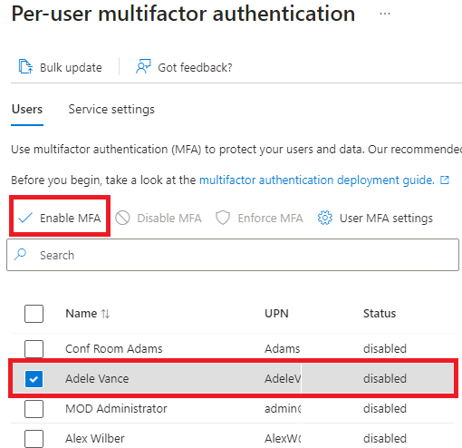

---
lab:
  title: '08: habilitar Azure AD Multi-Factor Authentication'
  learning path: '02'
  module: Module 02 - Implement an Authentication and Access Management Solution
---

# Laboratorio 8: habilitaación de Azure AD Multi-Factor Authentication

## Escenario del laboratorio

Para mejorar la seguridad de tu organización, se te ha dirigido a habilitar la autenticación multifactor de Azure Active Directory.

#### Tiempo estimado: 15 minutos

**IMPORTANTE**: se requiere una licencia de Azure AD Premium para este ejercicio.

### Ejercicio 1: revisión y habilitación de la autenticación multifactor en Azure

#### Tarea 1: revisar las opciones de Azure Multi-Factor Authentication

1. Ve a [https://portal.azure.com](https://portal.azure.com) e inicia sesión con una cuenta de administrador global para el directorio.

2. Usa la característica de búsqueda y busca **multifactor**.

3. En los resultados de la búsqueda, selecciona **Autenticación multifactor**.

4. En la página Introducción, en **Configurar**, selecciona **Configuración adicional de MFA basado en la nube**.

    

5. En la nueva página del explorador, puedes ver las opciones de MFA para los usuarios de Azure y la configuración del servicio.

    

    Aquí es donde se seleccionan los métodos de autenticación admitidos, todos ellos seleccionados en la pantalla anterior.

    También puede habilitar o deshabilitar aquí las contraseñas de aplicación, que permiten a los usuarios crear contraseñas de cuenta únicas para las aplicaciones que no admiten la autenticación multifactor. Esta característica permite que el usuario se autentique con su identidad de Azure AD mediante otra contraseña específica para esa aplicación.

#### Tarea 2: configurar reglas de acceso condicional de MFA para Delia Dennis

A continuación se verá cómo configurar las reglas de directivas de acceso condicional que aplicarán MFA para los usuarios invitados que accedan a aplicaciones específicas en la red.

1. Vuelve a Azure Portal y selecciona **Azure Active Directory**, luego, **Seguridad** y, por último, **Acceso condicional**.

2. En el menú, selecciona **+ Nueva directiva**. En el menú desplegable selecciona **Crear nueva directiva**.

    

3. Asigna un nombre a tu directiva, por ejemplo **MFA_para_Delia**.

4. Selecciona **Identidades de usuarios o cargas de trabajo** en Asignaciones.

    - Selecciona **0 usuarios o identidades de carga de trabajo seleccionadas**  
    - En la pantalla de la derecha, selecciona la casilla **Seleccionar usuarios y grupos** para configurar.
    - Comprueba **Usuarios y grupos** (los usuarios disponibles se rellenarán a la derecha)
    - Elige **Delia Dennis** en la lista de usuarios y después presiona el botón **Seleccionar**.

5. Seleccione **Aplicaciones en la nube o acciones**.

   - En la lista desplegable, asegúrate de que la opción **Aplicaciones en la nube** esté seleccionada.
   - En Incluir, marca **Todas las aplicaciones en la nube** y lee la advertencia que aparece sobre la posibilidad de quedarte afuera. 
   - Ahora, en Incluir, cambia la opción al elemento **Seleccionar aplicaciones**.
   - En el cuadro de diálogo recién abierto, elige **Office 365**.
      - **Recordatorio:** en un laboratorio anterior le dimos a Delia Dennis una licencia de Office 365 e iniciamos sesión para asegurarnos de que funcionaba.
   - Elija **Seleccionar**.

6. Revise la sección Condiciones.

   - Seleccione **Ubicaciones** y, después, establézcala en **Cualquier ubicación**.

7. En **Controles de acceso**, selecciona **Conceder** y comprueba que la opción **Conceder acceso** esté seleccionada.

8. Selecciona la casilla **Requerir autenticación multifactor** para aplicar MFA.

9. Asegúrate de que **Requerir todos los controles seleccionados** esté seleccionado.

10. Elija **Seleccionar**.

11. Establezca **Habilitar directiva** en **Activado**.

12. Selecciona **Crear** para crear la directiva.

    

    Ahora MFA está habilitado para las aplicaciones y el usuario seleccionados. La próxima vez que un invitado intente iniciar sesión en esa aplicación, se le pedirá que se registre para MFA.

#### Tarea 3: probar el inicio de sesión de Delia

1. Abre una nueva ventana del explorador de InPrivate.
2. Conectarse a https://www.office.com.
3. Selecciona la opción de inicio de sesión.
4. Escribe **DeliaD@**`<<your domain address>>`.
5. Introduce la contraseña = Introduce la contraseña de administrador global del inquilino (Nota: consulta la pestaña "Recursos de laboratorio" para recuperar la contraseña de administrador).

**Nota**: en este punto, puede suceder una de estas dos cosas.  Deberías recibir un mensaje que te pida que configures la aplicación Authenticator y registrarte para la MFA.  Sigue las indicaciones para completar el uso de tu teléfono personal.  NOTA: es posible que recibas un mensaje de error de inicio de sesión con varias opciones sobre cómo continuar.  Selecciona la opción **Volver a intentarlo** en este caso.

Puedes ver que, debido a la regla de acceso condicional que creamos para Delia, se requiere la MFA para iniciar la página principal de Office 365.

### Ejercicio 2: configuración de la MFA para que sea obligatoria para iniciar sesión

#### Tarea 1: configurar la MFA por usuario de Azure AD

Por último, se describirá cómo configurar MFA para cuentas de usuario. Es otra manera de acceder a la configuración de la autenticación multifactor.

1. Vuelve al panel de Azure Active Directory en Azure Portal.

2. Seleccione **Usuarios**.

3. En la parte superior del panel Usuarios, selecciona **MFA por usuario**.

   

4. Se abrirá una nueva pestaña o ventana del explorador con un cuadro de diálogo de configuración de usuario de autenticación multifactor.

   Puede habilitar o deshabilitar MFA por usuario si selecciona uno y después sigue los pasos rápidos del lado derecho.

   

5. Selecciona **Adele Vance** con una marca de verificación.
6. Selecciona la opción **Habilitar** de los pasos rápidos.
7. Lee la ventana emergente de notificación si aparece y, después, selecciona el botón **Habilitar autenticación multifactor**.
8. Seleccione **Cerrar**.
9. Observa que Adele ahora tiene **Habilitado** su estado de MFA.
10. Puedes seleccionar la **configuración del servicio** para ver la pantalla de configuración de MFA, que ya se ha visto en el laboratorio.
11. Cierra la pestaña de configuración de MFA.

#### Tarea 2: probar el inicio de sesión como Adele

1. Si deseas ver otro ejemplo del proceso de inicio de sesión de MFA, puedes intentar iniciar sesión con Adele.
