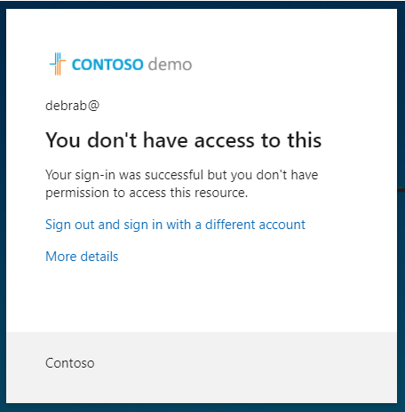

---
lab:
  title: '13: implementar y probar una directiva de acceso condicional'
  learning path: '02'
  module: Module 02 - Implement an Authentication and Access Management Solution
---

# Laboratorio 13: implementar y probar una directiva de acceso condicional

### Tipo de inicio de sesión = Administración de Microsoft 365

## Escenario del laboratorio

Tu organización debe poder limitar el acceso de los usuarios a sus aplicaciones internas. Debes implementar una directiva de acceso condicional de Microsoft Entra.

**Nota**: En el caso de las directivas de acceso condicional, puedes desactivar los valores predeterminados de seguridad, los puntos clave que se deben recordar son del entrenamiento.  Puedes encontrar información adicional sobre los valores predeterminados de seguridad en este vínculo: <https://docs.microsoft.com/en-us/azure/active-directory/fundamentals/concept-fundamentals-security-defaults>

#### Tiempo estimado: 20 minutos

### Ejercicio 1: Establecer una directiva de acceso condicional para impedir que DebraB acceda a Sway

#### Tarea 1: Confirmar que DebraB tenga acceso a Sway

1. Inicia una nueva ventana del explorador InPrivate.
2. Conéctese a [https://www.office.com](https://www.office.com). 
3. Cuando se te solicite, inicia sesión como DebraB:

  | Configuración | Valor |
  | :--- | :--- |
  | Nombre de usuario | **DebraB@**`<<your lab domain>>.onmicrosoft.com` |
  | Contraseña | Escribe la contraseña de administrador del inquilino (consulta la pestaña Recursos del laboratorio para recuperar la contraseña de administrador del inquilino). |
    
4. Omite las pantallas de bienvenida e introducción.

5. Abre la página de **Aplicaciones** y selecciona el icono de **Sway** para comprobar que se carga correctamente.

6. Cierra sesión en Office y cierra la sesión del explorador.

#### Tarea 2: crear una directiva de acceso condicional

El acceso condicional de Microsoft Entra es una característica avanzada de Microsoft Entra ID que te permite especificar directivas detalladas que controlan quién puede tener acceso a los recursos. Con el acceso condicional, puede proteger las aplicaciones mediante la limitación del acceso de los usuarios en función de aspectos como los grupos, el tipo de dispositivo, la ubicación y el rol.

1. Ve a [https://entra.microsoft.com](https://entra.microsoft.com) e inicia sesión con una cuenta de administrador global para el directorio.

2. Abre el menú del portal y selecciona  **Microsoft Entra ID**.

3. En el menú en **Identidad**, selecciona **Protección**.

4. En la página Seguridad, en el panel de navegación izquierdo, selecciona **Acceso condicional**.

5. En **información general (versión preliminar),** pulsa **+ Crear nueva directiva**.

   

6. En el cuadro **Nombre**, escribe **Bloquear Sway para DebraB**.

   **Nota:** Usa esta nomenclatura para ayudarte a reconocer rápidamente la directiva y su función.

7. En **Asignaciones**, selecciona **0 usuarios y grupos seleccionados**

8. En la pestaña Incluir, selecciona **Seleccionar usuarios y grupos** y luego marca la casilla **Usuarios y grupos**.

9. En el panel Seleccionar, selecciona **Office 365** y luego selecciona **Seleccionar**.

10. En **Recursos de destino**, selecciona **No se ha seleccionado ningún recurso de destino**.

11. Comprueba que **Aplicaciones en la nube** está seleccionado y luego selecciona **Seleccionar aplicaciones** y luego selecciona **Ninguno** en la sección de seleccionar.

12. En el panel Seleccionar, busca **Sway** y selecciona **Sway** y luego selecciona **Seleccionar**.

13. En **Controles de acceso** en la sección **Concesión**, selecciona **0 controles seleccionados**.

14. En el panel de concesión, seleccione **Bloquear acceso** y, a continuación, seleccione **Seleccionar**.

   **Nota**: Esta directiva se está configurando solo para el ejercicio y se usa para mostrar rápidamente una directiva de acceso condicional.

15. En **Habilitar directiva**, seleccione **Activar** y después seleccione **Crear**.

   

#### Tarea 3: probar la directiva de acceso condicional

Debe probar las directivas de acceso condicional para asegurarse de que funcionan según lo previsto.

1. Abre una nueva pestaña del explorador 'InPrivate' y luego ve a [https://sway.office.com](https://sway.office.com).
    - Cuando se te solicite, inicia sesión como DebraB:

   | Configuración | Valor |
   | :--- | :--- |
   | Nombre de usuario | **DebraB@**`<<your lab domain>>.onmicrosoft.com` |
   | Contraseña | Escribe la contraseña de administrador del inquilino (consulta la pestaña Recursos del laboratorio para recuperar la contraseña de administrador del inquilino). |
     
2. Comprueba que no puedes acceder a Microsoft Sway.

   

3. Si has iniciado sesión, cierra la pestaña, espera 1 minuto y vuelve a intentarlo.
    
   **Nota**: Si ha iniciado sesión automáticamente en Sway como DebraB, debe cerrar sesión manualmente.  Las credenciales y el acceso se almacenaron en caché.  Una vez que cierre sesión e inicie sesión, la sesión de Sway debe denegar el acceso.

4. Cierra la pestaña y vuelve a la página Acceso condicional.

5. Selecciona la directiva **Bloquear Sway para DebraB**.

6. En **Habilitar directiva**, seleccione **Desactivar** y, después, seleccione **Guardar**.

### Ejercicio 2: usar What If para probar las directivas de acceso condicional

#### Tarea: usar What if para probar las directivas de acceso condicional

1. Abre el menú del Centro de administración Microsoft Entra y selecciona  **Microsoft Entra ID**.

1. En el menú en **Identidad**, selecciona **Protección**.

1. En la página Seguridad, en el panel de navegación izquierdo, selecciona **Acceso condicional**.

1. En el panel de navegación, selecciona **Directivas**.

1. Selecciona **What If**.

1. En **Identidad de usuario o carga de trabajo**, selecciona **Ningún usuario o entidad de servicio seleccionada**.

1. Selecciona **DebraB** como usuario.

1. En **Aplicaciones, acciones o contexto de autenticación en la nube**, selecciona **Sway**. 

1. Selecciona **What if**. Se te facilitará un informe en la parte inferior del icono de **Directivas que se aplicarán** y **Directivas que no se aplicarán**.

Esto te permite probar las directivas y su efectividad antes de habilitar las directivas.

### Ejercicio 3: configuración de los controles de frecuencia de inicio de sesión mediante una directiva de acceso condicional

#### Tarea: usar el Centro de administración de Microsoft Entra para configurar el acceso condicional

Como parte de la configuración de seguridad más grande de tu empresa, debes probar una directiva de acceso condicional que se pueda usar para controlar la frecuencia de inicio de sesión.

1. Ve a [https://entra.microsoft.com](https://entra.microsoft.com) e inicia sesión con una cuenta de administrador global para el directorio.

2. Abre el menú del portal y selecciona  **Microsoft Entra ID**.

3. En el menú en **Identidad**, selecciona **Protección**.

4. En el menú de Protección, en el panel de navegación izquierdo, selecciona **Acceso condicional**.

5. En el menú desplegable, selecciona **+ Nueva política** del menú desplegable, selecciona **Crear una nueva política**.

   

6. En el cuadro **Nombre**, escriba **Frecuencia de inicio de sesión**.

7. En **Asignaciones**, selecciona **0 usuarios y grupos seleccionados**

8. En la pestaña Incluir, marca **Seleccionar usuarios y grupos** y luego selecciona la casilla **Usuarios y grupos**.

9. En el panel Seleccionar, selecciona tu cuenta **Grady Archie** y luego selecciona **Seleccionar**.

10. Seleccione **Aplicaciones en la nube o acciones**.

11. Compruebe que **Aplicaciones en la nube** está seleccionado y, a continuación, seleccione **Aplicaciones**.

12. En el panel Seleccionar, seleccione **Office 365** y, a continuación, **Seleccionar**.

13. En **Controles de acceso**, seleccione **Sesión**.

14. En el panel Sesión, selecciona **Frecuencia de inicio de sesión**.

15. En el cuadro valor, escriba **30**.

16. Seleccione el menú de unidades, seleccione **Días**y, a continuación, seleccione **Seleccionar**.

17. En **Habilitar directiva**, seleccione **Solo informe** y, después, seleccione **Crear**.

   

   **NOTA**: El modo de solo informe es un nuevo estado de la directiva de acceso condicional que permite a los administradores evaluar el impacto de las directivas de acceso condicional antes de habilitarlas en su entorno. Con la versión del modo de solo informe:
    
- Las directivas de acceso condicional se pueden habilitar en modo de solo informe.
- Durante el inicio de sesión, las directivas en modo de solo informe se evalúan, pero no se aplican.
- Los resultados se registran en las pestañas Acceso condicional y Solo informe de los detalles de registro de inicio de sesión.
- Los clientes con una suscripción de Azure Monitor pueden supervisar el impacto de sus directivas de acceso condicional  mediante el libro Conditional Access Insights.
