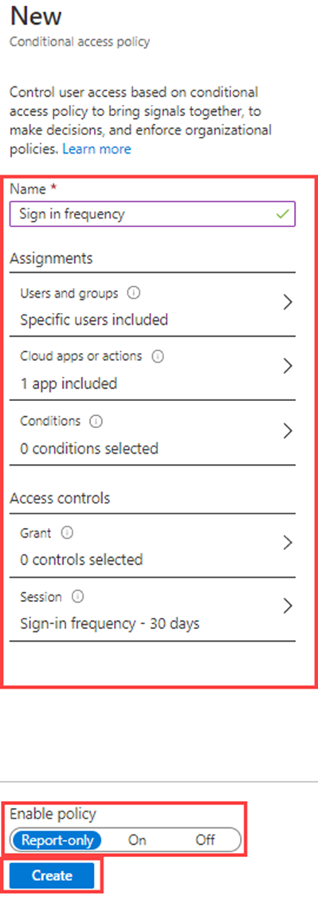

---
lab:
  title: '13: implementar y probar una directiva de acceso condicional'
  learning path: '02'
  module: Module 02 - Implement an Authentication and Access Management Solution
---

# Laboratorio 13: implementar y probar una directiva de acceso condicional

## Escenario del laboratorio

Tu organización debe poder limitar el acceso de los usuarios a sus aplicaciones internas. Debe implementar una directiva de acceso condicional de Azure Active Directory.

**Nota**: en el caso de las directivas de acceso condicional, puedes desactivar los valores predeterminados de seguridad. Los puntos clave que se deben recordar están en la formación.  Puedes encontrar información adicional sobre los valores predeterminados de seguridad en este vínculo: <https://docs.microsoft.com/en-us/azure/active-directory/fundamentals/concept-fundamentals-security-defaults>

#### Tiempo estimado: 30 minutos

### Ejercicio 1: establecimiento de una directiva de acceso condicional para impedir que DebraB acceda a Yammer

#### Tarea 1: confirmar que DebraB tiene acceso a Yammer

1. Inicia una nueva ventana del explorador de InPrivate.
2. Conéctese a [https://www.office.com](https://www.office.com). 
3. Cuando el sistema te lo solicite, inicia sesión como DebraB:

   | Configuración | Valor |
   | :--- | :--- |
   | Nombre de usuario | **DebraB@**`<<your lab domain>>.onmicrosoft.com` |
   | Contraseña | Escribe la contraseña de administrador del inquilino (consulta la pestaña Recursos del laboratorio para recuperar la contraseña de administrador del inquilino). |
    
4. Selecciona el mosaico de Yammer para ver que se carga correctamente.

#### Tarea 2: crear una directiva de acceso condicional

El acceso condicional de Azure Active Directory es una característica avanzada de Azure AD que te permite especificar directivas detalladas que controlan quién puede tener acceso a los recursos. Con el acceso condicional, puede proteger las aplicaciones mediante la limitación del acceso de los usuarios en función de aspectos como los grupos, el tipo de dispositivo, la ubicación y el rol.

1. Ve a [https://portal.azure.com](https://portal.azure.com) e inicia sesión con una cuenta de administrador global para el directorio.

2. Abre el menú del portal y después, selecciona  **Azure Active Directory**.

3. En la página Azure Active Directory, en **Administrar**, selecciona **Seguridad**.

4. En la página Seguridad, en el panel de navegación izquierdo, selecciona **Acceso condicional**.

5. En la **información general (versión preliminar)**, haz clic en **+Crear nueva directiva**.

   

6. En el cuadro **Nombre**, escribe **Bloquear Yammer para DebraB**.

   **Nota:** usa esta nomenclatura para ayudarte a reconocer rápidamente la directiva y su función.

7. En **Assignments** (Asignaciones), seleccione **Users or workload identities** (Identidades de usuario o de carga de trabajo).

8. En la pestaña Incluir, seleccione la casilla **Usuarios y grupos**.

9. En el panel Seleccionar, selecciona la cuenta **DebraB** y, después, **Seleccionar**.

10. Seleccione **Aplicaciones en la nube o acciones**.

11. Compruebe que **Aplicaciones en la nube** está seleccionado y, a continuación, seleccione **Aplicaciones**.

12. En el panel Seleccionar, busqua **Yammer** y selecciona **Office 365 Yammer** y después, **Seleccionar**.

13. En **Controles de acceso**, seleccione **Conceder**.

14. En el panel de concesión, seleccione **Bloquear acceso** y, a continuación, seleccione **Seleccionar**.

   **Nota**: esta directiva se está configurando solo para el ejercicio y se usa para mostrar rápidamente una directiva de acceso condicional.

15. En **Habilitar directiva**, seleccione **Activar** y después seleccione **Crear**.

   

#### Tarea 3: probar la directiva de acceso condicional

Debe probar las directivas de acceso condicional para asegurarse de que funcionan según lo previsto.

1. Abre una nueva pestaña de 'Inprivate' del explorador y después, ve a [https://www.yammer.com/office365](https://www.yammer.com/office365).
    - Cuando el sistema te lo solicite, inicia sesión como DebraB:

   | Configuración | Valor |
   | :--- | :--- |
   | Nombre de usuario | **DebraB@**`<<your lab domain>>.onmicrosoft.com` |
   | Contraseña | Escribe la contraseña de administrador del inquilino (consulta la pestaña Recursos del laboratorio para recuperar la contraseña de administrador del inquilino). |
     
2. Comprueba que se le impide acceder correctamente a Microsoft Yammer.

   

3. Si has iniciado sesión, cierra la pestaña, espera 1 minuto y vuelve a intentarlo.
    
   **Nota**: si se inicia la sesión de DebraB automáticamente en Yammer, tendrás que cerrar sesión manualmente. Las credenciales y el acceso se han almacenado en la caché.  Cuando cierres sesión y vuelvas a iniciarla, la sesión de Yammer debería denegar el acceso.

4. Cierra la pestaña y vuelve a la página Acceso condicional.

5. Selecciona la directiva de **Acceso condicional de Yammer**.

6. En **Habilitar directiva**, seleccione **Desactivar** y, después, seleccione **Guardar**.

### Ejercicio 2: usar What If para probar las directivas de acceso condicional

#### Tarea: usar What if para probar las directivas de acceso condicional

1. Abre el menú del portal y después, selecciona  **Azure Active Directory**.

1. En la página Azure Active Directory, en **Administrar**, selecciona **Seguridad**.

1. En la página Seguridad, en el panel de navegación izquierdo, selecciona **Acceso condicional**.

1. En el panel de navegación, selecciona **Directivas**.

1. Selecciona **What If**.

1. En **Identidad de usuario o carga de trabajo**, selecciona **Ningún usuario o servicio principal seleccionado**.

1. Elige **DebraB** como usuario.

1. En **Contexto de aplicaciones, acciones o autenticación en la nube**, selecciona **Yammer**. 

1. Selecciona **What if**. Se te proporcionará un informe en la parte inferior del mosaico de **Directivas que se aplicarán** y **Directivas que no se aplicarán**.

Esto le permite probar las directivas y su efectividad antes de habilitarlas.

### Ejecicio 3: configuración de los controles de frecuencia de inicio de sesión mediante una directiva de acceso condicional

#### Tarea: usar Azure Portal para configurar el acceso condicional

Como parte de la configuración de seguridad más grande de tu empresa, debes probar una directiva de acceso condicional que se pueda usar para controlar la frecuencia de inicio de sesión

1. Ve a [https://portal.azure.com](https://portal.azure.com) e inicia sesión con una cuenta de administrador global para el directorio.

2. Abre el menú del portal y después, selecciona  **Azure Active Directory**.

3. En la página Azure Active Directory, en **Administrar**, selecciona **Seguridad**.

4. En la página Seguridad, en el panel de navegación izquierdo, selecciona **Acceso condicional**.

5. En el menú superior, selecciona **+ Nueva directiva** del menú desplegable y selecciona **Crear una nueva directiva**.

   

6. En el cuadro **Nombre**, escriba **Frecuencia de inicio de sesión**.

7. En **Assignments** (Asignaciones), seleccione **Users or workload identities** (Identidades de usuario o de carga de trabajo).

8. En la pestaña Incluir, seleccione la casilla **Usuarios y grupos**.

9. En el panel Seleccionar, elige tu cuenta de **Grady Archie** y, luego, **Seleccionar**.

10. Seleccione **Aplicaciones en la nube o acciones**.

11. Compruebe que **Aplicaciones en la nube** está seleccionado y, a continuación, seleccione **Aplicaciones**.

12. En el panel Seleccionar, seleccione **Office 365** y, a continuación, **Seleccionar**.

13. En **Controles de acceso**, seleccione **Sesión**.

14. En el panel Sesión, selecciona **Frecuencia de inicio de sesión**.

15. En el cuadro valor, escriba **30**.

16. Seleccione el menú de unidades, seleccione **Días**y, a continuación, seleccione **Seleccionar**.

17. En **Habilitar directiva**, seleccione **Solo informe** y, después, seleccione **Crear**.

   

   **NOTA**: el modo de solo informe es un nuevo estado de la directiva de acceso condicional que permite a los administradores evaluar el impacto de las directivas de acceso condicional antes de habilitarlas en el entorno. Con la versión del modo de solo informe:
    
- Las directivas de acceso condicional se pueden habilitar en modo de solo informe.
- Durante el inicio de sesión, las directivas en modo de solo informe se evalúan, pero no se aplican.
- Los resultados se registran en las pestañas Acceso condicional y Solo informe de los detalles de registro de inicio de sesión.
- Los clientes con una suscripción de Azure Monitor pueden supervisar el impacto de sus directivas de acceso condicional  mediante el libro Conditional Access Insights.
