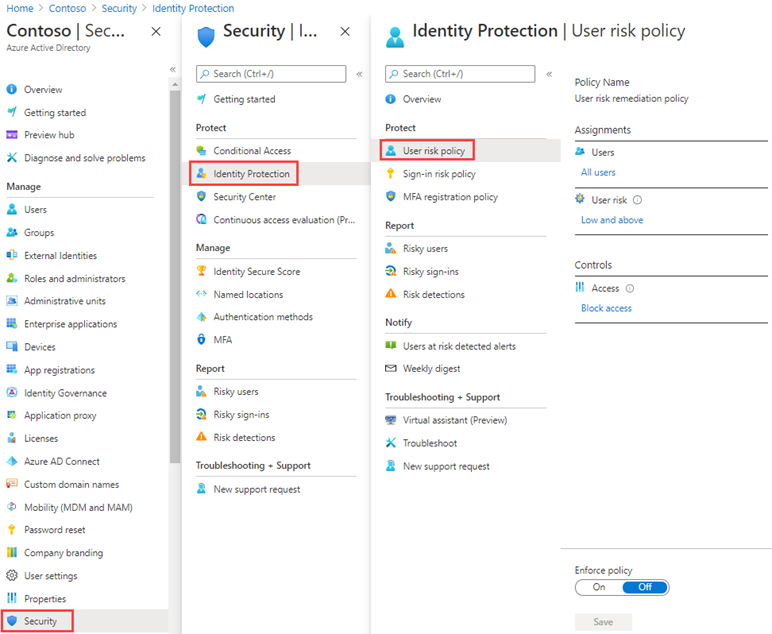

---
lab:
  title: '14: habilitar el inicio de sesión y las directivas de riesgo de los usuarios'
  learning path: '02'
  module: Module 02 - Implement an Authentication and Access Management Solution
---

# Laboratorio 14: habilitar el inicio de sesión y las directivas de riesgo de los usuarios

### Tipo de inicio de sesión = Administración de Microsoft 365

## Escenario del laboratorio

Como capa adicional de seguridad, debes habilitar y configurar las directivas de riesgo de inicios de sesión y de usuarios de tu organización de Microsoft Entra.

#### Tiempo estimado: 10 minutos

### Ejercicio 1: habilitar una directiva de riesgo de usuario

#### Tarea 1: configurar la directiva

1. Inicia sesión en [https://entra.microsoft.com]( https://entra.microsoft.com) con una cuenta de administrador global.

2. Abre el menú del portal y selecciona  **Microsoft Entra ID**.

3. En el menú, en **Identidad**, seleccione **Protección**.

4. En la página Seguridad, en el panel de navegación izquierdo, selecciona **Protección de identidad**.

5. En la página de protección de identidades, en el panel de navegación izquierdo, selecciona **Directiva de riesgo de usuario**.

    

6. En **Asignaciones**, seleccione **Todos los usuarios** y revise las opciones disponibles.

7. Puede elegir entre **Todos los usuarios** o **Seleccionar individuos o grupos** si quiere limitar el lanzamiento.

8. Además, puede decidir excluir usuarios de la directiva.

9. En **Riesgo de usuario**, seleccione **Bajo y superior**.

10. En el panel Riesgo de usuario, seleccione **Alto** y, luego, haga clic en **Listo**.

11. En **Controles** > **Acceso**, seleccione **Bloquear acceso**.

12. En el panel Acceso, revise las opciones disponibles.

    **Sugerencia**: la recomendación de Microsoft es Permitir acceso y Requerir cambio de contraseña.

13. Active la casilla **Requerir cambio de contraseña** y seleccione **Listo**.

14. En **Cumplimiento de directivas**, selecciona **Habilitado** y después selecciona **Guardar**.

#### Tarea 2: habilitar la directiva de riesgo de inicio de sesión

1. En la página de protección de identidades, en el panel de navegación de la izquierda, selecciona **Directiva de riesgo de inicio de sesión**.

2. Al igual que con la directiva de riesgo de usuario, la directiva de riesgo de inicio de sesión se puede asignar a usuarios y grupos, y permite excluir usuarios de la directiva.

3. En **Riesgo de inicio de sesión**, selecciona **Baja y superior**.

4. En el panel Riesgo de inicio de sesión, seleccione **Alto** y, luego, elija **Listo**.

5. En **Controles** > **Acceso**, seleccione **Bloquear acceso**.

6. Active la casilla **Requerir autenticación multifactor** y, a continuación, seleccione **Listo**.

7. En **Cumplimiento de directivas**, selecciona **Habilitado** y después selecciona **Guardar**.
