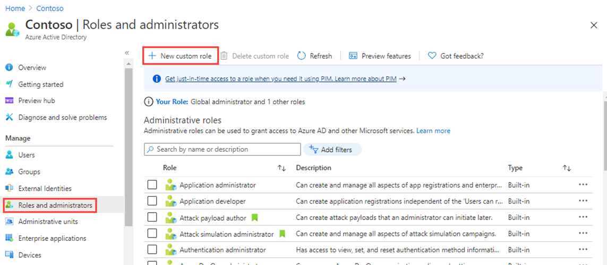

---
lab:
  title: 19 - Registro de una aplicación
  learning path: '03'
  module: Module 03 - Implement Access Management for Apps
---

# Laboratorio 19: registro de una aplicación

#### Tiempo estimado: 30 minutos

### Ejercicio 1: registro de una aplicación

#### Tarea 1: registrar aplicaciones

El registro de la aplicación establece una relación de confianza entre la aplicación y la plataforma de identidad de Microsoft. La confianza es unidireccional: la aplicación confía en la plataforma de identidad de Microsoft y no al revés.

1. Iniciar sesión en [https://portal.azure.com](https://portal.azure.com)  con una cuenta de administrador global.

2. Abre el menú del portal y después, selecciona  **Azure Active Directory**.

3. En la hoja **Azure Active Directory**, en **Administrar**, seleccione **Registros de aplicaciones**.

4. En el menú de la página **Registros de aplicaciones**, seleccione **+ Nuevo registro**.

5. En la hoja **Registrar una aplicación**, registre una aplicación denominada **Aplicación de demostración** con los valores predeterminados. No es necesario que escriba el URI de redirección.

    

6. Cuando haya terminado, accederá a la hoja **Aplicación de demostración**.


#### Tarea 2: establecer la configuración de la plataforma

La configuración de cada tipo de aplicación, incluidos los URI de redirección, se realiza en  **Configuraciones de la plataforma**  en Azure Portal. Algunas plataformas, como  **Web** y las  **aplicaciones de página única**, requieren que se especifique manualmente un URI de redirección. Para otras plataformas, como las de aplicaciones móviles y de escritorio, es posible elegir entre los URI de redirección que se generan automáticamente al configurar las demás opciones.

Para configurar los valores de la aplicación según la plataforma o el dispositivo de destino:


1. Para agregar y modificar los URI de redirección de las aplicaciones registradas, especifique los parámetros en la opción Configuración de la plataforma.

1. Selecciona la aplicación en  **Registros de aplicaciones** en Azure Portal.

2. En  **Administrar**, selecciona  **Autenticación**.

3. En  **Configuraciones de la plataforma**, selecciona  **+ Agregar una plataforma**.

4. En  **Configurar plataformas**, selecciona el mosaico del tipo de aplicación (plataforma) para configurar.

    

    | Plataforma| Parámetros de configuración|
    | :--- | :--- |
    | Web| Escribe un  **URI de redirección**  para tu aplicación, la ubicación en la que la plataforma de identidad de Microsoft redirige el cliente de un usuario y envía los tokens de seguridad después de la autenticación. Seleccione esta plataforma para las aplicaciones web estándar que se ejecuten en un servidor.|
    | Aplicación de una sola página| Escribe un  **URI de redirección**  para tu aplicación, la ubicación en la que la plataforma de identidad de Microsoft redirige el cliente de un usuario y envía los tokens de seguridad después de la autenticación. Seleccione esta plataforma si va a desarrollar una aplicación web de cliente en JavaScript, o bien con un marco de trabajo como Angular, Vue.js, React.js o Blazor WebAssembly.|
    | iOS/macOS| Introduce el  **Id. del paquete** de la aplicación, que se encuentra en XCode en  *Info.plist*  o en Configuración de compilación.   Al especificar un ID de agrupación, se genera un URI de redirección.|
    | Android| Introduce el  **nombre del paquete** de la aplicación, que puedes encontrar en el archivo AndroidManifest.xml, y genera e introduce el  **hash de firma**. Al especificar estos valores, se genera un URI de redirección.|
    | Aplicaciones móviles y de escritorio| Selecciona uno de los  **URI de redirección sugeridos** o especifica un  **URI de redirección personalizado**. En el caso de las aplicaciones de escritorio, se recomienda: [https://login.microsoftonline.com/common/oauth2/nativeclient](https://login.microsoftonline.com/common/oauth2/nativeclient). Seleccione esta plataforma para las aplicaciones móviles que no utilicen la biblioteca de autenticación de Microsoft (MSAL) más reciente o que no usen un agente. Seleccione también esta plataforma para las aplicaciones de escritorio.|

5. Selecciona  **Configurar**  para completar la configuración de la plataforma.

#### Tarea 3: agregar credenciales, certificados y secreto de cliente

Las credenciales se usan con las aplicaciones cliente confidenciales que acceden a una API web. Ejemplos de aplicaciones cliente confidenciales son, entre otras, las aplicaciones web, las API web o las aplicaciones de tipo demonio y de tipo servicio. Las credenciales permiten que la aplicación se autentique a sí misma, por lo que no se requiere la interacción del usuario en tiempo de ejecución.

Puede agregar certificados y secretos de cliente (una cadena) como credenciales al registro de la aplicación cliente confidencial.


>**Nota**: a veces denominados  *clave pública*, los certificados son el tipo de credenciales que se recomienda, ya que proporcionan más seguridad que un secreto de cliente. Al usar un certificado público de confianza, puede agregar el certificado mediante la característica Certificados y secretos. El certificado debe ser uno de los siguientes tipos de archivo: .cer, .pem, .crt.


>**Nota**: el secreto de cliente, también conocido como  *contraseña de aplicación*, es un valor de cadena que tu aplicación puede utilizar en lugar de un certificado para identificarse. Esta opción es la más fácil de usar de los dos tipos de credenciales. A menudo se usa durante el desarrollo, pero se considera menos seguro que un certificado. Debería utilizar los certificados cuando las aplicaciones se ejecuten en el entorno de producción.

1. Selecciona la aplicación en  **Registros de aplicaciones** en Azure Portal.

2. En  **Certificados y secretos**, selecciona  **Nuevo secreto de cliente**.

3. Agregue una descripción para el secreto de cliente.

4. Seleccione una duración.

5. Seleccione **Agregar**.

6. **Guarda el valor del secreto en el Bloc de notas** para su uso en el código de la aplicación cliente. La página Certificado y secretos mostrará el nuevo valor secreto. Es importante que copies este valor, ya que solo se muestra esta vez; si dejas la página y vuelves, solo se mostrará como un valor enmascarado.

1. Omite las secciones  **Agregar un URI de redireccionamiento** y  **Configurar la plataforma** . No es necesario configurar un URI de redireccionamiento para las API web, ya que ningún usuario inicia sesión de forma interactiva.

1. Omite la sección  **Agregar las credenciales** por ahora. La API necesitaría sus propias credenciales solo si accede a otra de nivel inferior, pero este escenario no se trata en este artículo.

Una vez registrada la API web, está listo para agregar los ámbitos que el código de la API puede usar para proporcionar permisos pormenorizados a los consumidores de la API.


#### Tarea 5: agregar un ámbito

El código de las aplicaciones cliente solicita permiso para realizar operaciones definidas por la API web; para ello, pasa un token de acceso junto con sus solicitudes al recurso protegido (la API web). A continuación, la API web realiza la operación solicitada solo si el token de acceso que recibe contiene los ámbitos (también conocidos como permisos de aplicación) necesarios para la operación.

En primer lugar, siga estos pasos para crear un ámbito de ejemplo denominado Employees.Read.All:

1. Inicie sesión en Azure Portal.

2. Si tienes acceso a varios inquilinos, usa el filtro  **Directorio + suscripción**  del menú superior para seleccionar el inquilino que contiene el registro de la aplicación cliente.

3. Selecciona  **Azure Active Directory** > **Registros de aplicaciones** y el registro de la aplicación de API.

4. Selecciona  **Exponer una API** y, luego, elige  **+ Agregar un ámbito**.

    

5. Se te pedirá que establezcas un valor de  **URI de Id. de aplicación** si aún no has configurado uno. El URI de identificación de aplicación actúa como prefijo de los ámbitos a los que se hará referencia en el código de la API y debe ser único globalmente. Puedes usar el valor predeterminado proporcionado, que tiene el formato \<application-client-id\>, o especificar un URI más legible, como  `https://contoso.com/api`.

6. Seleccione **Guardar y continuar**.

6. Después, especifica los atributos del ámbito en el panel  **Agregar un ámbito**. Para este tutorial, puede usar los valores de ejemplo o especificar los suyos propios.

    | Campo| Description| Ejemplo|
    | :--- | :--- | :--- |
    | Nombre de ámbito| Nombre del ámbito. Una convención de nomenclatura de ámbito común es resource.operation.constraint.| Employees.Read.All|
    | ¿Quién puede dar el consentimiento?| Si los usuarios pueden dar su consentimiento a este ámbito o si se requiere el consentimiento del administrador. Seleccione Solo administradores para permisos con más privilegios.| Administradores y usuarios|
    | Nombre para mostrar del consentimiento del administrador| Breve descripción del propósito del ámbito que solo verán los administradores.| Acceso de solo lectura a los registros de empleados.|
    | Descripción del consentimiento del administrador| Descripción más detallada del permiso concedido por el ámbito que solo verán los administradores.| Permite que la aplicación obtenga acceso de solo lectura a todos los datos de los empleados.|
    | Nombre para mostrar del consentimiento del usuario| Descripción breve del propósito del ámbito. Se muestra a los usuarios solo si establece Quién puede dar el consentimiento en Administradores y usuarios.| Acceso de solo lectura a los registros de los empleados.|
    | Descripción del consentimiento del usuario| Descripción más detallada del permiso concedido por el ámbito. Se muestra a los usuarios solo si establece Quién puede dar el consentimiento en Administradores y usuarios.| Permite que la aplicación obtenga acceso de solo lectura a los datos de los empleados.|

7. Establece  **Estado** en  **Habilitado** y selecciona  **Agregar ámbito**.

8. (Opcional) Para eliminar la solicitud de consentimiento por parte de los usuarios de tu aplicación en los ámbitos que has definido, puedes  *autorizar previamente* a la aplicación cliente para que acceda a tu API web. Debes autorizar previamente  *únicamente* las aplicaciones cliente en las que confíes, ya que los usuarios no tendrán la oportunidad de rechazar el consentimiento.

   1. En  **Aplicaciones cliente autorizadas**, selecciona  **Agregar una aplicación cliente**

   2. Escribe el valor de  **Id. de aplicación (cliente)** de la aplicación cliente que deseas preautorizar. Por ejemplo, el de una aplicación web que ha registrado previamente.

   3. En  **Ámbitos autorizados**, selecciona los ámbitos en que quieras suprimir la solicitud de consentimiento y, después, selecciona  **Agregar aplicación**.

   4. Si ha seguido este paso opcional, la aplicación cliente será ya una aplicación cliente preautorizada (PCA) y no se pedirá a los usuarios su consentimiento al iniciar sesión en ella.

#### Tarea 6: agregar un ámbito que requiera el consentimiento del administrador

A continuación, agregue otro ámbito de ejemplo denominado Employees.Write.All para el que solo los administradores puedan dar su consentimiento. Los ámbitos que requieren el consentimiento del administrador se suelen usar para proporcionar acceso a operaciones de mayor privilegio y, a menudo, los usan aplicaciones cliente que se ejecutan como servicios de back-end o demonios que no inician sesión de forma interactiva.

1. Para agregar el ámbito de ejemplo Employees.Write.All, sigue los pasos anteriores y especifica estos valores en el panel  **Agregar un ámbito** :

    | Campo| Valor de ejemplo|
    | :--- | :--- |
    | Nombre de ámbito| Employees.Write.All|
    | ¿Quién puede dar el consentimiento?| Solo administradores|
    | Nombre para mostrar del consentimiento del administrador| Acceso de escritura a los registros de empleados.|
    | Descripción del consentimiento del administrador| Permite que la aplicación obtenga acceso de escritura a todos los datos de los empleados.|
    | Nombre para mostrar del consentimiento del usuario| Ninguno (deje este campo en blanco)|
    | Descripción del consentimiento del usuario| Ninguno (deje este campo en blanco)|

    >**Nota**: si has agregado correctamente los dos ámbitos de ejemplo descritos en las secciones anteriores, aparecerán en el panel  **Exponer una API** del registro de la aplicación de API web, de forma similar a esta imagen:

    

    Como se muestra en la imagen, la cadena completa de un ámbito es la concatenación de los valores de  **URI de Id. de aplicación**  de la API web y  **Nombre de ámbito** del ámbito.

1. Prueba la API con el **URI del identificador de aplicación** con "/Employees.Read.All" agregado al final del URI.

    >**Nota**: por ejemplo, si el URI de Id. de aplicación de tu API web es `https://contoso.com/api` y el nombre del ámbito es Employees.Read.All, el ámbito completo es: `https://contoso.com/api/Employees.Read.All`


    >**Nota**: después, configurarás el registro de una aplicación cliente con acceso a tu API web y a los ámbitos que hayas definido mediante los pasos anteriores.
    Una vez que el registro de una aplicación cliente tenga permiso para acceder a la API web, se puede emitir un token de acceso de OAuth 2.0 para el cliente mediante la plataforma de identidad de Microsoft. Cuando el cliente llama a la API web, presenta un token de acceso cuya demanda de ámbito (scp) se establece en los permisos especificados en el registro de la aplicación cliente.
    Puede exponer ámbitos adicionales posteriormente si es necesario. Tenga en cuenta que la API web puede exponer varios ámbitos asociados a varias operaciones. El recurso puede controlar el acceso a la API web en tiempo de ejecución, mediante la evaluación de las notificaciones de ámbito (scp) del token de acceso de OAuth 2.0 recibido.


### Ejercicio 2: creación de un rol personalizado para administrar el registro de aplicaciones

#### Tarea 1: crear un rol personalizado para conceder acceso para administrar los registros de aplicaciones

Debes crear un nuevo rol personalizado para la administración de aplicaciones. Este nuevo rol debe limitarse solo a los permisos específicos necesarios para realizar la administración de credenciales.

1. Inicia sesión en  [https://portal.azure.com](https://portal.azure.com)  con una cuenta de administrador global.

2. Abre el menú del portal y después, selecciona  **Azure Active Directory**.

3. En la hoja Azure Active Directory, en **Administrar**, selecciona **Roles y administradores**.

4. En la hoja Roles y administradores, en el menú, selecciona **+Nuevo rol personalizado**.

    

5. En la hoja Nuevo rol personalizado, en la pestaña Aspectos básicos, en el cuadro Nombre, escribe **Mi rol de aplicación personalizado**.

6. Revise el resto de la configuración y seleccione **Siguiente**.

7. En la pestaña Permisos, revise los permisos disponibles.

8. En el cuadro **Buscar por nombre o descripción del permiso**, escribe las **credenciales**.

9. En los resultados, seleccione **Administrar permisos** y, a continuación, seleccione **Siguiente**.

    ```
       microsoft.directory/servicePrincipals/managePasswordSingleSignOnCredentials  -   Manage password single sign-on credentials or service principals.
       microsoft.directory/servicePrincipals/synchronizationCredentials/manage    -   Manage application provisioning secrets and credentials.
    ```

    

    **Por qué elegir esos dos elementos**: en el aprovisionamiento, estas dos aplicaciones son los permisos mínimos necesarios para habilitar y aplicar el inicio de sesión único para la aplicación o la entidad de servicio que se está creando, y para poder asignar la aplicación empresarial a un conjunto de usuarios o grupos.  También se pueden conceder otros permisos.  Puedes obtener una lista completa de los permisos disponibles en `https://docs.microsoft.com/azure/active-directory/roles/custom-enterprise-app-permissions`.

10. Revise los valores y luego seleccione **Crear**.

