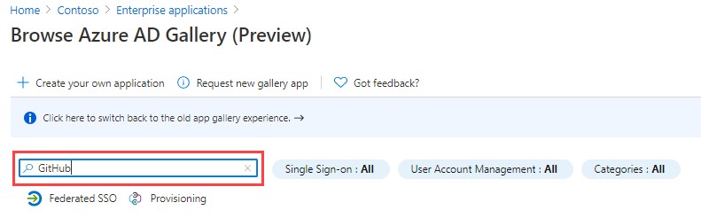

---
lab:
  title: 20 - Implementar la administración del acceso para aplicaciones
  learning path: '03'
  module: Module 03 - Implement Access Management for Apps
---

# Laboratorio 20: implementación de la administración del acceso para aplicaciones

## Escenario del laboratorio

Tu organización requiere que solo usuarios o grupos específicos tengan acceso a las aplicaciones empresariales. Tienes que asignar un usuario a una aplicación específica.

#### Tiempo estimado: 5 minutos

### Ejercicio 1: configuración de una aplicación empresarial

#### Tarea 1: agregar una aplicación a tu inquilino de Azure AD

1. Inicia sesión en  [https://portal.azure.com](https://portal.azure.com)  con una cuenta de administrador global.

2. Abre el menú del portal y después, selecciona  **Azure Active Directory**.

3. En la página de Azure Active Directory, en **Administrar**, selecciona **Aplicaciones empresariales**.

4. En el panel Aplicaciones empresariales, selecciona **+ Nueva aplicación**.

    

5. En la página Examinar la Galería de Azure AD (versión preliminar), en el cuadro **Buscar aplicación**, introduce **GitHub**.

    

6. En los resultados, seleccione **GitHub Enterprise Cloud - Enterprise Account**.

7. En la **GitHub Enterprise Cloud – Enterprise Account**, revise la configuración y, después, seleccione **Crear**.

8. Una vez creada, se te redirigirá a la página de GitHub Enterprise Cloud - Enterprise Account.

#### Tarea 2: asignar usuarios a una aplicación

1. En la página GitHub Enterprise Cloud-Enterprise Account, en la página Información general, en **Introducción**, selecciona **1. Asignar usuarios y grupos**.

2. Como alternativa, en el panel de navegación izquierdo, en **Administrar**, puede seleccionar **Usuarios y grupos**.

3. En la página Usuarios y grupos, en el menú, selecciona **+Agregar usuario/grupo**.

4. En la página Agregar asignación, selecciona **Usuarios y grupos**.

5. En el panel Usuarios y grupos, selecciona tu cuenta de administrador y después selecciona **Seleccionar**.

    

6. Seleccione **Asignar**.

