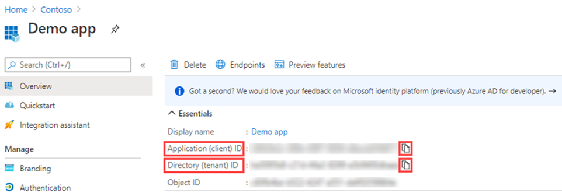

---
lab:
  title: '21: conceder el consentimiento del administrador para todo el inquilino a una aplicación'
  learning path: '03'
  module: Module 03 - Implement Access Management for Apps
---

# Laboratorio 21: conceder el consentimiento del administrador para todo el inquilino a una aplicación

### Tipo de inicio de sesión = Administración de Microsoft 365

## Escenario del laboratorio

Para las aplicaciones que haya desarrollado la organización, o bien las que se hayan registrado directamente en el inquilino de Microsoft Entra, puede conceder el consentimiento del administrador para todo el inquilino desde los Registros de aplicaciones en Azure Portal.

#### Tiempo estimado: 15 minutos

### Ejercicio 1: conceder consentimiento del administrador

#### Tarea 1: conceder el consentimiento del administrador en Registros de aplicaciones

   **Advertencia**: la concesión del consentimiento del administrador para todo el inquilino a una aplicación concederá acceso a la aplicación y al publicador de la aplicación a los datos de la organización. Antes de conceder el consentimiento, revise con atención los permisos que solicita la aplicación.

El rol de administrador global es necesario para proporcionar el consentimiento del administrador para los permisos de aplicación en Microsoft Graph API.

1. En un ejercicio anterior creó una aplicación denominada Aplicación de demostración. Si es necesario, en el Centro de administración de Microsoft Entra, ve a **Identidad**, **Aplicaciones**, selecciona  **Registros de aplicaciones ** y selecciona después **Aplicación de demostración**.

2. En la pantalla de la **Aplicación de demostración**, busca, copia y guarda los valores de **id. de aplicación (cliente)** y de **id. de directorio (inquilino)** para poder usarlos más adelante.

    **Nota** - **la aplicación de demostración** se crea en los laboratorios anteriores. Completa estos laboratorios antes de este.

    

3. En el panel de navegación izquierdo, en **Administrar**, seleccione **Permisos de API**.

4. En **Permisos configurados**, seleccione **Conceder consentimiento del administrador**.

    

5. Revise el cuadro de diálogo y, a continuación, seleccione **Sí**.

   **Advertencia**: la concesión del consentimiento del administrador para todo el inquilino a través de Registros de aplicaciones revocará todos los permisos concedidos previamente en todo el inquilino. Los permisos que los usuarios hayan concedido previamente en su propio nombre no se verán afectados.

#### Tarea 2: conceder el consentimiento del administrador en las aplicaciones de Enterprise

Puede conceder el consentimiento del administrador para todo el inquilino a través de Aplicaciones empresariales si la aplicación ya se ha aprovisionado en el inquilino.

1. En el Centro de administración Microsoft Entra, ve a **Identidad** y **Aplicaciones**.

2. En el menú abre **Aplicaciones empresariales**.

3. En la lista de aplicaciones empresariales elige la **Aplicación de demostración** que hemos registrado anteriormente.

4. En la página **Aplicación de demostración**, en el panel de navegación izquierdo, selecciona **Permisos** en la sección **Seguridad**.

5. En **Permisos**, seleccione **Conceder consentimiento del administrador**.

    

   **Advertencia**: la concesión del consentimiento del administrador para todo el inquilino a través de Registros de aplicaciones revocará todos los permisos concedidos previamente en todo el inquilino. Los permisos que los usuarios hayan concedido previamente en su propio nombre no se verán afectados.

6. Cuando se le solicite, inicie sesión con la cuenta de administrador global.

7. En el cuadro de diálogo **Permisos solicitados**, revise la información y seleccione **Aceptar**.
