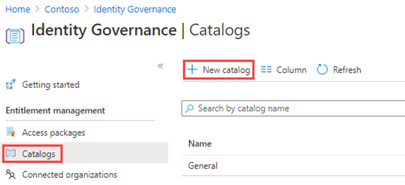

---
lab:
  title: '22: crear y administrar un catálogo de recursos en la administración de derechos de Microsoft Entra'
  learning path: '04'
  module: Module 04 - Plan and Implement and Identity Governance Strategy
---

# Laboratorio 22: crear y administrar un catálogo de recursos en la administración de derechos de Microsoft Entra

### Tipo de inicio de sesión = Administración de Microsoft 365

## Escenario del laboratorio

Un catálogo es un contenedor de recursos y paquetes de acceso. Creará un catálogo cuando quiera agrupar recursos relacionados y paquetes de acceso. Quien cree el catálogo se convertirá en su primer propietario. El propietario de un catálogo puede agregar otros propietarios. Debes crear y configurar un catálogo en tu organización.

#### Tiempo estimado: 15 minutos

### Ejercicio 1: crear recursos en administración de derechos

#### Tarea 1: crear un catálogo

1. Inicia sesión en [https://entra.microsoft.com](https://entra.microsoft.com) con una cuenta de administrador global.

    **Importante**: para usar y configurar los términos de uso de Microsoft Entra, debes cumplir los siguientes requisitos:
    - Suscripción de Microsoft Entra ID Premium P1, P2, EMS E3 o EMS E5.
    - Si no tienes una de estas suscripciones, puedes obtener la versión de prueba de Microsoft Entra ID Premium.
    - Una de las siguientes cuentas de administrador para el directorio que quiera configurar:
        - Administrador global
        - Administrador de seguridad
        - Administrador de acceso condicional

2. Abre el menú **Identidad** y después selecciona **Identity Governance**.

3. En el menú de la izquierda, en **Administración de derechos**, seleccione **Catálogos**.

4. En el menú superior, selecciona **+ Nuevo catálogo**.

    

5. En el panel Nuevo catálogo, en el cuadro **Nombre**, escriba **Marketing**.

6. En el cuadro **Descripción**, escriba **Para usuarios del departamento de marketing**. Los usuarios verán esta información en los detalles de un paquete de acceso.

7. En **Habilitado**, selecciona **Sí**.

  - **Habilitado para usuarios externos** selecciona **No**.  Esta configuración permite a los usuarios de los directorios externos seleccionados poder solicitar paquetes de acceso de este catálogo. No se realizarán cambios en esta configuración.

9. Puede optar por habilitar el catálogo para su uso inmediato o deshabilitarlo si desea agregarlo al "stage" o mantenerlo no disponible hasta que tenga previsto usarlo. Para este ejercicio, no es necesario habilitar el catálogo.

  

10. Seleccione **Crear**.

#### Tarea 2: agregar recursos a un catálogo

Para incluir recursos en un paquete de acceso, deben estar en un catálogo. Los tipos de recursos que puede agregar son grupos, aplicaciones y sitios de SharePoint Online. Los grupos pueden ser grupos de Microsoft 365 creados en la nube o grupos de seguridad de Microsoft Entra creados en la nube. Las aplicaciones pueden ser aplicaciones empresariales de Microsoft Entra, incluidas las aplicaciones SaaS y sus propias aplicaciones federadas en Microsoft Entra ID. Los sitios pueden ser sitios de SharePoint Online o colecciones de sitios de SharePoint Online.

1. En la página de Identity Governance, si es necesario, selecciona **Catálogos**.

2. En la lista **Catálogos**, seleccione **Marketing**.

3. En el panel de navegación izquierdo, en **Administrar**, seleccione **Recursos**.

4. En el menú, seleccione + **Agregar recursos**.

5. En la página Agregar recursos al catálogo, revisa las opciones disponibles.  Agrega los siguientes elementos:

   | Tipo de recurso | Valor |
   | :------------- | :---------- |
   |  **Grupos y equipos** | Minoristas |
   |  **Aplicaciones** | Box |
   |  **Aplicaciones** | Salesforce |
   |  **Sitios de SharePoint** | Marca: selecciona este SharePoint de la lista de sitios disponibles |

6. Es posible que no tenga ningún recurso en Grupos y Teams, aplicaciones o sitios de SharePoint. Seleccione cualquier categoría de recursos y, a continuación, seleccione un recurso de esa categoría.

7. Para este ejercicio, puede elegir cualquier recurso que haya disponible.

    

8. Cuando hayas finalizado, selecciona **Agregar**. Ahora, estos recursos se pueden incluir en paquetes de acceso del catálogo.

#### Tarea 3: incorporar propietarios de catálogo adicionales

El usuario que crea un catálogo se convierte en su primer propietario. Para delegar la administración de un catálogo, se agregan usuarios al rol de propietario del catálogo. Esto ayuda a compartir las responsabilidades de administración de los catálogos.

1. Si es necesario, en el Centro de administración Microsoft Entra, ve a **Identidad** y después **Gobernanza de identidades** y selecciona **Catálogos** y después **Marketing**.

2. En la página Catálogo de marketing, en el menú de navegación izquierdo, selecciona **Roles y administradores**.

    

3. En el menú superior, revisa los roles disponibles y, a continuación, selecciona **+ Agregar propietario del catálogo**.

4. En el panel Seleccionar miembros, selecciona **Adele Vance** y después **Seleccionar**.

5. Revise el rol recién agregado en la lista Roles y administradores.

#### Tarea 4: editar un catálogo

Puede editar el nombre y la descripción de un catálogo. Los usuarios ven esta información en los detalles de un paquete de acceso.

1. En la página Marketing, en la navegación izquierda, selecciona **Información general**.

2. En el menú superior, seleccione **Editar**.

3. Revise la configuración y, en **Propiedades** > **Habilitado**, seleccione **Sí**.

    

4. Seleccione **Guardar**.

#### Tarea 5: crear revisiones de acceso para usuarios invitados

1. Las revisiones de acceso pueden administrar el ciclo de vida de acceso.Microsoft Entra Identity Governance proporciona un panel de información general que muestra el estado de las revisiones de acceso. Selecciona **Revisiones de acceso** en el menú **Gobernanza de identidades**.

1. En el menú Revisión de acceso, puedes seleccionar **Revisiones de acceso** para configurar una revisión de acceso para los usuarios invitados. Seleccionarás **+ Nueva revisión de acceso** para crear la revisión de acceso del usuario invitado.El icono se abrirá para configurar la revisión de acceso para los usuarios invitados.

1. Selecciona **Equipos + grupos** para **Seleccionar qué revisar**.

1. En **Seleccionar ámbito de revisión**, selecciona **Todos los grupos de Microsoft 365 con usuarios invitados**

1. En **Seleccionar ámbito de usuario**, selecciona **Solo usuarios invitados**.

1. Seleccione **Siguiente: Revisiones**.

1. El siguiente icono es donde se configura quién revisa y aprueba el acceso, la frecuencia con la que se revisará el acceso y cuándo expirará el acceso.

1. En **Seleccionar revisores**, selecciona **Propietarios de grupo** como estos revisores.

  - **Nota**: como práctica recomendada de gobernanza de identidades, no se debe permitir que los usuarios invitados revisen su propio acceso.

1. Escribe la **Duración (en días)**, cuyo valor predeterminado es 3. Elige la **Periodicidad de revisión** y la **Fecha de inicio** para la revisión.

1. Selecciona **Siguiente: Configuración** y configura las opciones de cómo se realizará la revisión y qué ocurre cuando el usuario invitado responde o no responde.  Un procedimiento recomendado es seleccionar **Aplicar automáticamente los resultados al recurso** y seleccionar **Quitar acceso** para **Si los revisores no responden**. 

1. Selecciona **Siguiente: revisar + crear**, y selecciona **Crear** para crear la nueva revisión de acceso.

#### Tarea 6: eliminar un catálogo

Puede eliminar un catálogo, pero solo si no tiene ningún paquete de acceso.

1. En la página de información general del catálogo de marketing, en el menú superior, seleccione Eliminar.

2. En el cuadro de diálogo Quitar, revisa la información y después selecciona **No**.

    **Nota:** conservaremos el catálogo para su uso en el siguiente laboratorio.
