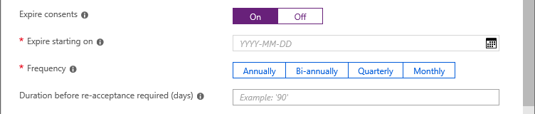
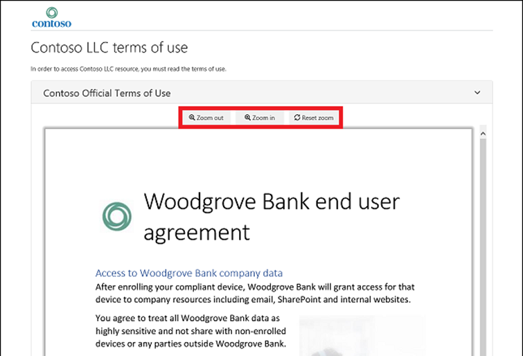
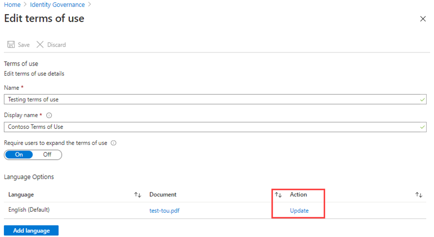

---
lab:
  title: 23 - Agregar los términos de uso y el informe de aceptación
  learning path: '04'
  module: Module 04 - Plan and Implement and Identity Governance Strategy
---

# Laboratorio 23: agregar los términos de uso y el informe de aceptación 

## Escenario del laboratorio

Las directivas de los términos de uso de Microsoft Entra ofrecen un método sencillo que las organizaciones pueden usar para presentar información a los usuarios finales. Esta presentación garantiza que los usuarios ven las declinaciones de responsabilidades pertinentes de los requisitos legales o de cumplimiento. En este artículo se describe cómo empezar a trabajar con las directivas de los términos de uso.

Debes crear y aplicar una directiva TOU para tu organización.

#### Tiempo estimado: 20 minutos

### Ejercicio 1: configuración y prueba de un término de uso

#### Tarea 1: agregar términos de uso

Una vez que haya finalizado el documento de términos de uso, use el procedimiento siguiente para agregarlo.

1. Inicia sesión en [https://entra.microsoft.com](https://entra.microsoft.com) con una cuenta de administrador global.

2. Abre seleccionando **Gobernanza de identidad** en el menú de navegación de la izquierda.

3. En el menú, en **Administración de derechos**, selecciona **Términos de uso**.

4. En la página Términos de uso, en el menú superior, seleccione **+ Nuevos términos**.

    

5. En el cuadro **Nombre**, escriba los **Términos de uso de prueba**.

    **Nota**: estos son los términos de uso que se usarán en Azure Portal.

6. En el **cuadro del documento de términos de uso**, vaya a su PDF de términos de uso finalizado y selecciónelo.

   **Archivo TOU incluido**: inicia sesión en el repositorio de GitHub AllFiles/Labs/Lab26 para obtener un documento PDF de términos de usuario de ejemplo para usar en este laboratorio.

7. En el cuadro **Nombre para mostrar**, escriba **Términos de uso de Contoso**.

    **Nota**: este es el título que los usuarios verán cada vez que inicien sesión.

8. Selecciona el idioma **Español** para tu documento de condiciones de uso.

   **Nota**: la opción de idioma te permite cargar varios términos de uso en diferentes idiomas. La versión de los términos de uso que verá un usuario final se basará en sus preferencias del explorador.

9. Para requerir a los usuarios finales que vean los términos de uso antes de aceptarlos, establezca **Requerir a los usuarios que expandan los términos de uso** en **Activado**.

10. Para exigir a los usuarios finales que acepten tus términos de uso en todos los dispositivos desde los que acceden, establece **Requerir el consentimiento de los usuarios en cada dispositivo** en **Desactivado**. Es posible que los usuarios deban instalar aplicaciones adicionales si esta opción está habilitada.

    **Advertencia**: el consentimiento en cada dispositivo obligará a los usuarios a registrar cada uno de ellos en Microsoft Entra ID para obtener acceso. Un procedimiento recomendado es requerir que esta configuración esté activada; sin embargo, para tener el laboratorio más despejado, usamos Desactivado.

11. Si quiere hacer expirar autorizaciones de términos de uso en una programación, establezca **Expirar autorizaciones** en **Activado**. Al establecerse en Activado, se muestran dos opciones de configuración de la programación adicionales.

    

12. Use las opciones de configuración **Expirar a partir del** y **Frecuencia** para especificar la programación para las expiraciones de términos de uso. En la siguiente tabla se muestra el resultado de un par de opciones de configuración de ejemplo:

    | Expirar a partir del | Frecuencia | Resultado |
    |---|---|---|
    | La fecha de hoy | Mensual | A partir de hoy, los usuarios deben aceptar los términos de uso y, después, volver a aceptarlos cada mes.|
    | Fecha del futuro | Mensual | A partir de hoy, los usuarios deben aceptar los términos de uso. Cuando la fecha del futuro llegue, expirarán las autorizaciones y, luego, los usuarios deberán volver a aceptar cada mes. |

    Por ejemplo, si establece la fecha de inicio de la expiración en **1 de enero** y la frecuencia en **Mensual**, este es el modo en que pueden producirse las expiraciones para dos usuarios:

    | Usuario | Primera fecha de aceptación | Primera fecha de expiración | Segunda fecha de expiración | Tercera fecha de expiración |
    |---|---|---|---|---|
    | Alice | 1 ene | 1 feb | 1 mar | 1 abr|
    | Bob | 15 ene | 1 feb | 1 mar| 1 abr |

13. Use la opción de configuración **Duración antes de solicitar que se acepten los términos de nuevo (días)** para especificar el número de días antes de que el usuario tenga que aceptar los términos de uso de nuevo. Esto permite a los usuarios seguir su propia programación. Por ejemplo, si establece la duración en **30** días, este es el modo en que pueden producirse las expiraciones para dos usuarios:

    | Usuario | Primera fecha de aceptación | Primera fecha de expiración | Segunda fecha de expiración | Tercera fecha de expiración |
    |---|---|---|---|---|
    | Alice | 1 ene | 31 ene | 2 mar | 1 abr|
    | Bob | 15 ene | 14 feb | 16 mar| 15 abr

    **Nota**: Es posible usar las opciones de configuración Expirar autorizaciones y Duración antes de solicitar que se acepten los términos de nuevo (días) de forma conjunta, pero normalmente usará una o la otra.

14. En **Acceso condicional**, seleccione **Directiva personalizada**.

    | Plantilla | Descripción |
    |---|---|
    | **Acceso a las aplicaciones en la nube para todos los invitados** | Se creará una directiva de acceso condicional para todos los invitados y todas las aplicaciones en la nube. Esta directiva afecta a Azure Portal. Una vez que se crea, es posible que se le pida cerrar e iniciar sesión. | 
    |**Acceso a las aplicaciones en la nube para todos los usuarios** | Se creará una directiva de acceso condicional para todos los usuarios y todas las aplicaciones en la nube. Esta directiva afecta a Azure Portal. Una vez que se crea, se le pedirá que cierre e inicie sesión. |
    | **Directiva personalizada** | Seleccione los usuarios, los grupos y las aplicaciones a los que se aplicarán estos términos de uso. |
    | **Crear directiva de acceso condicional posteriormente** | Estos términos de uso aparecerán en la lista de control de concesiones al crear una directiva de acceso condicional. |

    **IMPORTANTE**: Los controles de la directiva de acceso condicional (incluidos los términos de uso) no admiten el cumplimiento en las cuentas de servicio. Se recomienda excluir todas las cuentas de servicio de la directiva de acceso condicional.

    Las directivas personalizadas de acceso condicional permiten términos de uso pormenorizados, hasta una aplicación de nube o un grupo de usuarios específicos. Para obtener más información, vea [https://docs.microsoft.com/en-us/azure/active-directory/conditional-access/require-tou](https://docs.microsoft.com/en-us/azure/active-directory/conditional-access/require-tou).

15. Cuando haya finalizado, seleccione **Crear**.

    

16. Cuando se creen los términos de uso, se le redirigirá automáticamente a la página Directiva de acceso condicional. En la página, en el cuadro **Nombre**, escriba **Aplicar CDU**.

17. En **Asignaciones**, selecciona **Identidades de usuario**.

18. En la pestaña Incluir, seleccione la casilla **Usuarios y grupos**.

19. En el panel Seleccionar, selecciona **Adele Vance** para probar la directiva de términos de uso.

   **Aviso**: Si eliges tu cuenta de administrador, como en el caso de todas las directivas de acceso condicional, asegúrate de que tienes otra cuenta con permisos suficientes para cambiar la directiva de acceso condicional. Esto es para asegurarse de que la cuenta de administrador no se bloquee en caso de que la directiva de acceso condicional dé lugar a un resultado no deseado.

20. Selecciona **Recursos de destino.**

21. Seleccione **Todas las aplicaciones en la nube**.

22. En **Controles de acceso**, seleccione **Conceder**.

23. En el panel de concesión, seleccione **Términos de uso de prueba** y, a continuación, seleccione **Seleccionar**.

24. En **Habilitar directiva**, seleccione **Activar**.

25. Cuando haya finalizado, seleccione **Crear**.

    

26. Si decide usar su propia cuenta, puede actualizar el explorador. Se le pedirá que inicie sesión de nuevo. Al iniciar sesión, se le pedirá que acepte los términos de uso.

#### Tarea 2: Iniciar sesión como Adele

1. Abrir una ventana del explorador de InPrivate.
2. Debes conectarte a https://portal.azure.com.
3. Si aparece un mensaje de que ya has iniciado sesión, selecciona el nombre de los usuarios que han iniciado sesión en la esquina superior derecha de la pantalla y elige **Iniciar sesión con otra cuenta**.
4. Iniciar sesión como Adele:

    | Configuración | Valor que se va a especificar |
    | :--- | :--- |
    | Nombre de usuario | **AdeleV@**`<<your domain name>>.onmicrosoft.com` |
    | Contraseña | Escribe la contraseña de administrador del inquilino (consulta la pestaña Recursos del laboratorio para recuperar la contraseña del administrador de inquilinos). |

5. Valida el inicio de sesión de Adele con la solicitud MFA.
6. Ver los términos de uso
7. Puedes elegir **Aceptar** o **Rechazar**.

    **Nota**: Si eliges **rechazar**, durante un inicio de sesión futuro como AdeleV, será necesario volver a ver y aceptar los Términos de uso.

    **Nota**: Los términos de uso pueden tardar unos minutos en aparecer; también puedes cerrar sesión y volver a iniciar sesión en el portal.
 
#### Tarea 3: Ver un informe de quién los ha aceptado y rechazado

La hoja Términos de uso muestra un recuento de los usuarios que los han aceptado y rechazado. Estos recuentos, y quién aceptado o rechazado estos términos, se almacenan mientras están vigentes los términos de uso.

1. En Microsoft Azure, en **Gobierno de identidades > Términos de uso**, busca las condiciones de uso.

2. En una instancia de Términos de uso, seleccione los números situados en **Aceptado** o **Rechazado** para ver el estado actual de los usuarios.

    

3. En este ejercicio, es posible que no tenga términos de uso aceptados o rechazados. En el ejemplo siguiente, se ha seleccionado el valor **Aceptado**. Puede ver la información de usuario notificada de aquellos que han aceptado los términos de uso.

    

4. En la página **Consentimientos de Términos de uso**, selecciona **Descargar** para descargar un informe de consentimientos.

5. En la página **Gobernanza de identidades | Términos de uso**, resalta **Términos de uso de prueba** y selecciona **Ver registros de auditoría seleccionados** para ver la actividad de los registros de auditoría.

#### Tarea 4: Cómo aparecen los términos de uso para los usuarios

1. Una vez que se crean y aplican los términos de uso, los usuarios que están dentro del ámbito verán la página de términos de uso.

    

2. Los usuarios pueden ver los términos de uso y, si es necesario, usar los botones para acercar y alejar.

    

3. En los dispositivos móviles, los términos de uso se mostrarán de manera similar al ejemplo siguiente.

    

#### Tarea 5: Cómo los usuarios pueden revisar los términos de uso

Los usuarios pueden revisar y ver los términos de uso que han aceptado mediante el procedimiento siguiente.

1. Busque [https://myapps.microsoft.com](https://myapps.microsoft.com/) y, a continuación, inicie sesión con su cuenta de usuario.

2. Selecciona la foto del perfil de usuario y, a continuación, selecciona **Ver cuenta**. En la página de información general, seleccione VER CONFIGURACIÓN Y PRIVACIDAD.

    

3. En la página Configuración y privacidad, seleccione la pestaña **Privacidad**.

    

4. En **Aviso de la organización**, puede revisar los términos de uso que ha aceptado.

#### Tarea 6: Edición de los detalles de los términos de uso

Algunos de los detalles de los términos de uso se pueden editar, pero no se puede modificar un documento existente. El siguiente procedimiento describe cómo editar dichos detalles.

1. Inicia sesión en  [https://entra.microsoft.com](https://entra.microsoft.com) como Administrador global.

2. Abre el elemento de Microsoft Entra ID y selecciona  **Gobernanza de identidades** en el menú.

3. En el menú de navegación de la izquierda, en **Administración de derechos**, selecciona **Términos de uso**.

4. Seleccione los términos de uso que quiere editar.
 - Nota: tienes que hacer clic en el espacio abierto, no directamente en el nombre de los Términos o Uso.

5. En el menú superior, seleccione **Editar términos**.

6. En el panel Edición de condiciones de uso, puede cambiar lo siguiente:

    - **Nombre**: es el nombre interno de las condiciones de uso que no se comparten con los usuarios finales.
  
    - **Nombre para mostrar**: este es el nombre que los usuarios finales pueden observar al ver las condiciones de uso.

    - **Requerir a los usuarios que expandan las condiciones de uso**: si se establece en **Activo**, se forzará a que el usuario final expanda el documento con las condiciones de uso antes de aceptarlo.

    - **Actualice un documento de términos de uso existente**.

    - Puedes añadir un idioma a unos TdU existentes Si hay otras opciones de configuración que quieres cambiar, como requerir que los usuarios concedan su consentimiento en todos los dispositivos, expirar consentimientos, duración antes de solicitar que se acepten los términos de nuevo o la directiva de acceso condicional, debes crear unos términos de uso nuevos.

    

7. Cuando haya terminado, seleccione **Guardar** para guardar los cambios.

#### Tarea 7: Actualización de un documento de términos de uso existente

En ocasiones, puede que sea necesario actualizar el documento de términos de uso.

1. Seleccione los términos de uso que quiere editar.

2. Seleccione **Editar términos**.

3. En la tabla **Opciones de idioma**, identifique el idioma de los términos de uso que desea actualizar y, a continuación, en la columna **Acción**, seleccione **Actualizar**.

    

4. En el panel Actualizar versión de los términos de uso, puede cargar una nueva versión del documento de términos de uso.

5. También puede usar el botón de alternancia **Requerir nueva aceptación**, en caso de que desee requerir a los usuarios que acepten esta nueva versión la próxima vez que inicien sesión. Si no requiere una nueva aceptación por parte de los usuarios, su consentimiento anterior seguirá siendo el actual y solo los usuarios nuevos que no hayan dado su consentimiento anteriormente o cuyo consentimiento expire verán la nueva versión.

    

6. Una vez que haya cargado el nuevo PDF y elegido volver a aceptar, seleccione **Agregar**.

7. Ahora verá la versión más reciente en la columna Documento.
