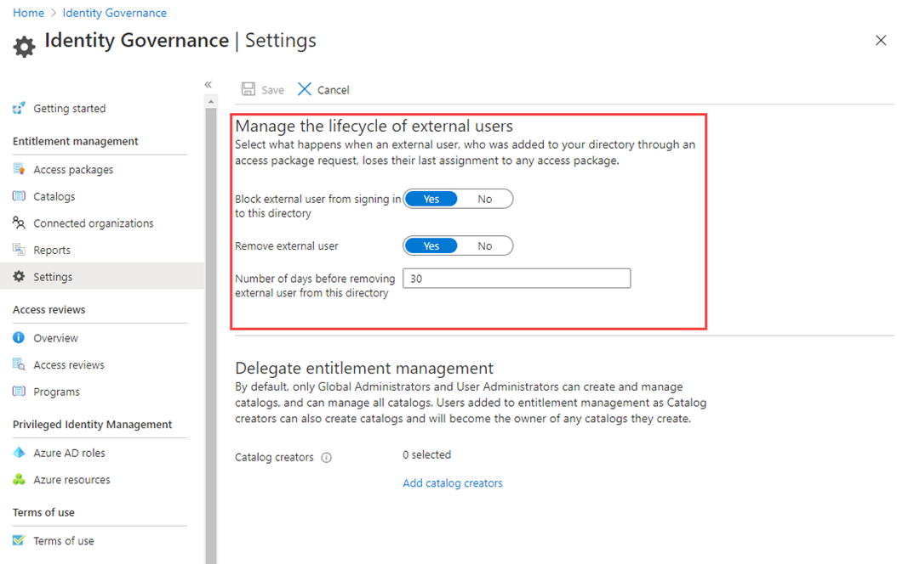

---
lab:
  title: '24: administrar el ciclo de vida de los usuarios externos en la configuración de Microsoft Entra Identity Governance'
  learning path: '04'
  module: Module 04 - Plan and Implement and Identity Governance Strategy
---

# Laboratorio 24: administrar el ciclo de vida de los usuarios externos en la configuración de la gobernanza de Microsoft Entra Identity

### Tipo de inicio de sesión = Administración de Microsoft 365

## Escenario del laboratorio

Puede seleccionar lo que ocurre cuando un usuario externo, invitado a su directorio mediante una solicitud de paquete de acceso aprobada, ya no tiene ningún paquete de acceso asignado. Esto puede ocurrir si el usuario renuncia a todas sus asignaciones de paquetes de acceso o la asignación del último paquete de acceso expira. De forma predeterminada, cuando un usuario externo ya no tiene un paquete de acceso asignado, se le impide iniciar sesión en el directorio. Después de 30 días, la cuenta de usuario invitado se quitará del directorio.

#### Tiempo estimado: 5 minutos

### Ejercicio 1: configurar Microsoft Entra Identity Governance

#### Tarea 1: administrar el ciclo de vida de los usuarios externos en la configuración de Microsoft Entra Identity Governance.

1. Inicia sesión en  [https://entra.microsoft.com](https://entra.microsoft.com) como Administrador global.

2. Abre Microsoft Entra ID y selecciona  **Identity Governance**.

3. En el menú de navegación izquierdo, en **Administración de derechos**, seleccione **Configuración**.

4. En el menú superior, seleccione **Editar**.

    

5. En la sección **Administración del ciclo de vida de los usuarios externos**, revise las diferentes opciones para los usuarios externos.

6. Cuando un usuario externo pierde la última asignación de un paquete de acceso, si desea bloquearlo para que no inicie sesión en este directorio, establezca **Impedir que los usuarios externos inicien sesión en este directorio** en **Sí**.

7. Si un usuario tiene bloqueada la capacidad de iniciar sesión en el directorio, el usuario no podrá volver a solicitar el paquete de acceso ni solicitar acceso adicional en este directorio. No configure el bloqueo de inicio de sesión si posteriormente necesitará solicitar acceso a otros paquetes de acceso.

8. Cuando un usuario externo pierde la última asignación de un paquete de acceso, si quiere quitar su cuenta de usuario invitado de este directorio, establezca **Quitar usuario externo** en **Sí**.

    **Nota**: La administración de derechos solo quita las cuentas a las que se ha invitado mediante la administración de derechos. Tenga en cuenta también que se impedirá que el usuario inicie sesión y se eliminará del directorio aunque dicho usuario se haya agregado a recursos del directorio que no eran asignaciones de paquetes de acceso. Si el invitado estaba presente en este directorio antes de recibir las asignaciones de paquetes de acceso, se mantendrá. Sin embargo, si se le invitó mediante una asignación de paquete de acceso y, después de invitarlo, se ha asignado a un sitio de OneDrive para la Empresa o SharePoint Online, se quitará.

9. Si quiere quitar la cuenta de usuario invitado de este directorio, puede establecer el número de días antes de que se quite. Si desea quitar la cuenta de usuario invitado en cuanto pierda la última asignación a cualquier paquete de acceso, establezca **Número de días antes de que se quite el usuario externo de este directorio** en **0**.

10. Si ha realizado algún cambio, seleccione **Guardar**.
