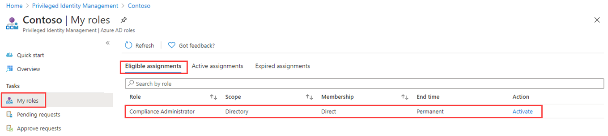

---
lab:
  title: '26: configurar Privileged Identity Management para roles de Microsoft Entra'
  learning path: '04'
  module: Module 04 - Plan and Implement and Identity Governance Strategy
---

# Laboratorio 26: configurar Privileged Identity Management para roles de Microsoft Entra

## Escenario del laboratorio

Un administrador de roles con privilegios puede personalizar Privileged Identity Management (PIM) en su organización de Microsoft Entra, incluido cómo cambiar la experiencia de un usuario que va a activar una asignación de roles apta. Debes familiarizarte con la configuración de PIM.

#### Tiempo estimado: 30 minutos

NOTA: se han producido cambios en el uso de MFA en entornos de laboratorio.  Cuando cambies entre usuarios para completar este laboratorio, es posible que se te pida que configures MFA.

### Ejercicio 1: configurar la configuración de roles de Microsoft Entra

#### Tarea 1: abrir la configuración del rol

Sigue estos pasos para abrir la configuración de un rol de Microsoft Entra.

1. Inicia sesión en  [https://entra.microsoft.com](https://entra.microsoft.com) como Administrador global.

2. Busca y luego selecciona **Privileged Identity Management.**

3. En la página de Privileged Identity Management, en el panel de navegación izquierdo, selecciona **Roles de Microsoft Entra**.

4. En la página Inicio rápido, en el panel de navegación izquierdo, seleccione **Configuración.**

    

5. Revise la lista de roles y, a continuación, en **Buscar por nombre de rol**, escriba **cumplimiento**.

6. En los resultados, seleccione **Administrador de cumplimiento**.

7. Revise la información de detalles de configuración de rol.

#### Tarea 2: requerir aprobación para activar

Si se establecen varios aprobadores, la aprobación se completa en cuanto uno de ellos aprueba o deniega. No se puede exigir la aprobación de al menos dos usuarios. Para solicitar aprobación a fin de activar un rol, siga estos pasos.

1. En la página Detalles de configuración de rol, en el menú superior, seleccione **Editar**.

    

2. En la página Editar configuración de rol: Administrador de cumplimiento, selecciona la casilla **Requiere aprobación para activar**.

3. Seleccione **Seleccionar aprobadores**.

4. En el panel Seleccionar un miembro, seleccione su cuenta de administrador y, después, **Seleccionar**.

    

5. Una vez que haya especificado la configuración del rol, seleccione **Actualizar** para guardar los cambios.

### Ejercicio 2: PIM con roles de Microsoft Entra

#### Tarea 1: asignar un rol

Con Microsoft Entra ID, un administrador Global puede hacer asignaciones permanentes de roles de administrador de Microsoft Entra. Estas asignaciones de roles pueden crearse utilizando el Centro de administración Microsoft Entra o mediante comandos de PowerShell.

El servicio Privileged Identity Management (PIM) permite también a los administradores de roles con privilegios realizar asignaciones de roles de administrador permanentes. Además, los administradores de rol con privilegios pueden hacer que los usuarios sean aptos administrar roles de Microsoft Entra. Un administrador apto puede activar el rol cuando lo necesite y, cuando termina, sus permisos caducan.

Sigue estos pasos para hacer que un usuario sea elegible para un rol de administrador de Microsoft Entra.

1. Inicia sesión en [https://entra.microsoft.com](https://entra.microsoft.com) con una cuenta de administrador global.

2. Busca y luego selecciona **Privileged Identity Management.**

    **Nota:** puedes encontrarlo en el menú de Identidad - Gobernanza de identidades - Privileged Identity Management.

3. En la página de Privileged Identity Management, en el panel de navegación izquierdo, selecciona **Roles de Microsoft Entra**.

4. En la página Inicio rápido, en el panel de navegación izquierdo, seleccione **Roles.**

5. En el menú superior, seleccione **+ Agregar asignaciones**.

    

6. En el panel Agregar asignaciones, en la pestaña **Pertenencia**, revisa la configuración.

7. Seleccione el menú **Seleccionar rol** y, a continuación, seleccione **Administrador de cumplimiento**.

8. Puede usar el filtro **Buscar rol por nombre** para ayudar a localizar un rol.

9. En **Seleccionar miembros**, seleccione **No hay miembros seleccionados**.

10. En el panel Seleccionar un miembro, selecciona **Miriam Graham** y luego selecciona **Seleccionar**.

    

11. En la página Agregar asignaciones, selecciona **Siguiente**.

12. En la pestaña **Configuración**, en **Tipo de asignación**, revise las opciones disponibles. Para esta tarea, use la configuración predeterminada.

    - Las asignaciones aptas requieren que el miembro del rol realice una acción para usarlo. Entre las acciones se puede incluir realizar una comprobación de autenticación multifactor (MFA), proporcionar una justificación de negocios o solicitar la aprobación de los aprobadores designados.
    - Las asignaciones activas no requieren que el miembro realice ninguna acción para usar el rol. Los miembros asignados como activos siempre tienen privilegios asignados al rol.

13. Revise el resto de la configuración y seleccione **Asignar**.

#### Tarea 2: iniciar sesión con Miriam

1. Abre una ventana del explorador InPrivate.
2. Conéctate al Centro de administración Microsoft Entra (https://entra.microsoft.com).
    **Nota**: si se abre con un usuario que ha iniciado sesión, selecciona su nombre en la esquina superior derecha y selecciona **Iniciar sesión con otra cuenta**.
3. Inicia sesión como Miriam.

   | Campo | Value |
   | :--- | :--- |
   | Nombre de usuario | **MiriamG@**`<<your domain.onmicrosoft.com>>` |
   | Contraseña |  Escribe la contraseña de administrador del inquilino (consulta la pestaña Recursos del laboratorio para recuperar la contraseña del administrador de inquilinos). |

4. En el menú **Identidad**, abre **Usuarios** y después selecciona **Todos los usuarios**.
5. Busca a **Miriam** en la lista de usuarios
6. En la página **Información general**, busca **Roles asignados**.
7. Selecciona **Asignaciones válidas**.
1. Ten en cuenta que el rol **Administrador de cumplimiento** ahora está disponible para Miriam.

#### Tarea 3: activar los roles de Microsoft Entra

Cuando necesites asumir un rol de Microsoft Entra, puedes solicitar la activación al abrir **Mis roles** en Privileged Identity Management.

1. En la barra **Buscar, recursos, servicios y documentos**, busca Con privilegios.
2. Abre la página **Privileged Identity Management**.
3. En la página Privileged Identity Management, en el panel de navegación izquierdo, selecciona **Mis roles**.

4. En la página Mis roles, revisa la lista de **asignaciones elegibles**.

    

5. En la fila del rol de administrador de cumplimiento, seleccione **Activar**.

6. En el panel Activar: administrador de cumplimiento, seleccione **Se requiere verificación adicional** y, a continuación, siga las instrucciones para proporcionar una verificación de seguridad adicional. Se le requiere que se autentique solo una vez por sesión.

    

    **Comprobación**: en función de la configuración actual del entorno de laboratorio, será necesario configurar MFA e iniciar sesión correctamente.

7. Una vez completada la verificación de seguridad adicional, en el panel Activar: administrador de cumplimiento, en el cuadro **Motivo**, rellena **Esta es mi justificación para activar este rol**.

    **Nota importante**: para la entidad de seguridad de menos privilegios, solo debes activar la cuenta durante el período de tiempo que la necesites.  Si son necesarias 1,5 horas para realizar el trabajo, establece la duración en dos horas.  De forma similar, si sabes que no podrás realizar el trabajo hasta después de las 3 p. m., elige una hora de activación personalizada.

8. Seleccione **Activar**.

#### Tarea 4: asignar un rol con ámbito restringido

Para determinados roles, el ámbito de los permisos concedidos se puede restringir a una sola unidad de administración, entidad de servicio o aplicación. Este procedimiento es un ejemplo si se asigna un rol con el ámbito de una unidad administrativa.

1. Recuerda cerrar las ventanas del explorador para MiriamG y luego abre el Centro de administración Microsoft Entra con tu cuenta de administrador.
2. Ve a la página Privileged Identity Management y, en el menú de navegación izquierdo, selecciona **Roles de Microsoft Entra** de Azure.
3. Seleccione **Roles**.
4. En la página Roles, en el menú superior, selecciona **+ Agregar asignaciones.**

5. En la página Agregar asignaciones, selecciona el menú **Seleccionar rol** y después, selecciona **Administrador de usuarios.**

6. Seleccione el menú **Tipo de ámbito** y revise las opciones disponibles. Por ahora, usará el tipo de ámbito **Directorio**.

   **Sugerencia**: ve a [https://docs.microsoft.com/en-us/azure/active-directory/roles/admin-units-manage](https://docs.microsoft.com/en-us/azure/active-directory/roles/admin-units-manage) para obtener más información sobre el tipo de ámbito de unidad administrativa.

7. Como hizo al asignar un rol sin un ámbito restringido, debe agregar los miembros y completar las opciones de configuración. Por ahora, seleccione **Cancelar**.

#### Tarea 5: actualizar o quitar una asignación de roles existente

Siga estos pasos para actualizar o quiotar una asignación de roles existente.

1. En la página Abrir roles de Privileged Identity Management > Microsoft Entra, en el panel de navegación izquierdo, selecciona **Asignaciones**.

2. En la lista **Asignaciones**, en Administrador de cumplimiento, revise las opciones de la columna **Acción**.

    

3. Seleccione **Actualizar** y revise las opciones disponibles en el panel Configuración de pertenencia. Cuando haya terminado, cierre el panel.

4. Seleccione **Quitar**.

5. En el cuadro de diálogo **Quitar**, revise la información y, a continuación, seleccione **Sí**.
