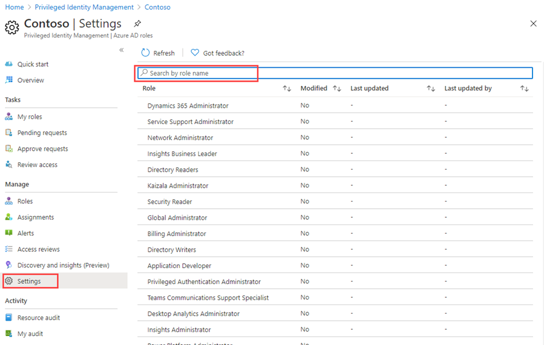
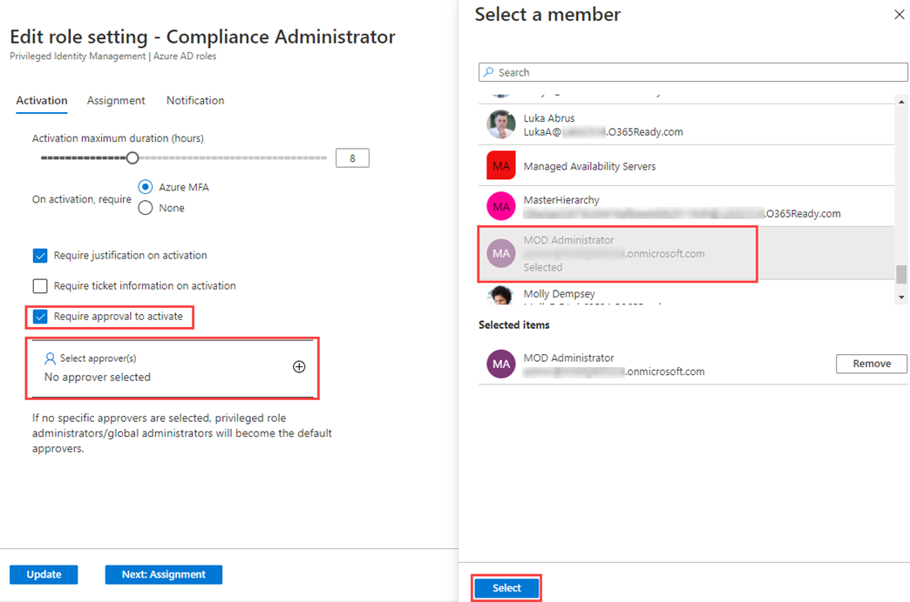

---
lab:
  title: '26: configurar Privileged Identity Management para roles de Azure AD'
  learning path: '04'
  module: Module 04 - Plan and Implement and Identity Governance Strategy
---

# Laboratorio 26: configurar Privileged Identity Management para roles de Azure AD

## Escenario del laboratorio

Un administrador de roles con privilegios puede personalizar Privileged Identity Management (PIM) en su organización de Azure Active Directory (Azure AD), incluido el cambio de la experiencia de un usuario que va a activar una asignación de rol válida. Debes familiarizarte con la configuración de PIM.

#### Tiempo estimado: 30 minutos

### Ejercicio 1: configurar roles de Azure AD

#### Tarea 1: abrir la configuración del rol

Siga estos pasos para abrir la configuración de un rol de Azure AD.

1. Inicia sesión en  [https://portal.azure.com](https://portal.azure.com) como Administrador global.

2. Busque y, a continuación, seleccione **Azure AD Privileged Identity Management.**

3. En la página Privileged Identity Management, en el panel de navegación izquierdo, selecciona **Roles de Azure AD**.

4. En la página Inicio rápido, en el panel de navegación izquierdo, seleccione **Configuración.**

    

5. Revise la lista de roles y, a continuación, en **Buscar por nombre de rol**, escriba **cumplimiento**.

6. En los resultados, seleccione **Administrador de cumplimiento**.

7. Revise la información de detalles de configuración de rol.

#### Tarea 2: requerir aprobación para activar

Si se establecen varios aprobadores, la aprobación se completa en cuanto uno de ellos aprueba o deniega. No se puede exigir la aprobación de al menos dos usuarios. Para solicitar aprobación a fin de activar un rol, siga estos pasos.

1. En la página Detalles de configuración de rol, en el menú superior, seleccione **Editar**.

    

2. En la página Editar configuración de rol: administrador de cumplimiento, activa la casilla **Requerir aprobación para activar**.

3. Seleccione **Seleccionar aprobadores**.

4. En el panel Seleccionar un miembro, seleccione su cuenta de administrador y, después, **Seleccionar**.

    

5. Una vez que haya especificado la configuración del rol, seleccione **Actualizar** para guardar los cambios.

### Ejercicio 2: PIM con roles de Azure AD

#### Tarea 1: asignar un rol

Con Azure Active Directory (Azure AD), un administrador global puede realizar asignaciones de roles de administrador de Azure AD permanentes. Estas asignaciones de roles se pueden crear mediante Azure Portal o mediante comandos de PowerShell.

El servicio Azure AD Privileged Identity Management (PIM) permite también a los administradores de roles con privilegios realizar asignaciones de roles de administrador permanentes. Además, los administradores de rol con privilegios pueden hacer que los usuarios sean aptos para roles de administrador de Azure AD. Un administrador apto puede activar el rol cuando lo necesite y, cuando termina, sus permisos caducan.

Siga estos pasos para hacer que un usuario sea elegible para un rol de administrador de Azure AD.

1. Inicia sesión en [https://portal.azure.com](https://portal.azure.com) con una cuenta de administrador global.

2. Busque y, a continuación, seleccione **Azure AD Privileged Identity Management.**

3. En la página Privileged Identity Management, en el panel de navegación izquierdo, selecciona **Roles de Azure AD**.

4. En la página Inicio rápido, en el panel de navegación izquierdo, seleccione **Roles.**

5. En el menú superior, seleccione **+ Agregar asignaciones**.

    

6. En la página Agregar asignaciones, en la pestaña **Pertenencia**, revisa la configuración.

7. Seleccione el menú **Seleccionar rol** y, a continuación, seleccione **Administrador de cumplimiento**.

8. Puede usar el filtro **Buscar rol por nombre** para ayudar a localizar un rol.

9. En **Seleccionar miembros**, seleccione **No hay miembros seleccionados**.

10. En el panel Seleccionar un miembro, selecciona **Miriam Graham** y después, **Seleccionar**.

    

11. En la página Agregar asignaciones, selecciona **Siguiente**.

12. En la pestaña **Configuración**, en **Tipo de asignación**, revise las opciones disponibles. Para esta tarea, use la configuración predeterminada.

    - Las asignaciones aptas requieren que el miembro del rol realice una acción para usarlo. Entre las acciones se puede incluir realizar una comprobación de autenticación multifactor (MFA), proporcionar una justificación de negocios o solicitar la aprobación de los aprobadores designados.
    - Las asignaciones activas no requieren que el miembro realice ninguna acción para usar el rol. Los miembros asignados como activos siempre tienen privilegios asignados al rol.

13. Revise el resto de la configuración y seleccione **Asignar**.

#### Tarea 2: iniciar sesión con Miriam

1. Abrir una ventana del explorador de InPrivate.
2. Conéctate a Azure Portal (https://portal.azure.com).
3. Si se abre y ya hay una sesión iniciada, selecciona el nombre en la esquina superior derecha y elige **Iniciar sesión con otra cuenta**.
4. Inicia sesión como Miriam.

   | Campo | Value |
   | :--- | :--- |
   | Nombre de usuario | **MiriamG@**`<<your domain.onmicrosoft.com>>` |
   | Contraseña |  Escribe la contraseña de administrador del inquilino (consulta la pestaña Recursos del laboratorio para recuperar la contraseña del administrador de inquilinos). |

5. Cierra el **diálogo Le damos la bienvenida a Azure**.
6. En la barra **Buscar recursos, servicios y documentos**, busca Azure Active Directory y abre la página.
7. En la página **Información general**, busca mi **Mi fuente**.
8. Selecciona **Ver perfil** en el nombre de Miriam Graham; se abrirá la página de perfil de Miriam.
9. Selecciona **Roles asignados** y después, **Asignaciones elegibles**.
10. Observa que el rol **Administrador de cumplimiento** ahora está disponible para Miriam.

#### Tarea 3: activar tus roles de Azure AD

Cuando necesite asumir un rol de Azure AD, puede solicitar la activación al abrir **Mis roles** en Privileged Identity Management.

1. Desde la barra **Búsqueda, recursos, servicios y documentos**, busca Con privilegios.
2. Abre la página **Administración de identidades privilegiadas de Azure AD**.
3. En la pantalla Privileged Identity Management, en la navegación izquierda, selecciona **Mis roles**.

4. En la página Mis roles, revisa la lista de asignaciones elegibles.

    

5. En la fila del rol de administrador de cumplimiento, seleccione **Activar**.

6. En el panel Activar: administrador de cumplimiento, seleccione **Se requiere verificación adicional** y, a continuación, siga las instrucciones para proporcionar una verificación de seguridad adicional. Se le requiere que se autentique solo una vez por sesión.

    

    **Comprobación**: en función de la configuración actual del entorno del laboratorio, será necesario configurar MFA e iniciar sesión correctamente.

7. Una vez completada la verificación de seguridad adicional, en el panel Activar: administrador de cumplimiento, en el cuadro **Motivo**, introduce **Esta es mi justificación para activar este rol**.

    **Nota Importante**: según el principio del privilegio mínimo, solo debes activar la cuenta durante el tiempo que la necesites.  Si es necesario realizar el trabajo, solo tarda 1,5 horas. Establece la duración en dos horas.  De forma similar, si sabes que no podrás realizar el trabajo hasta después de las tres de la tarde, elige una hora de activación personalizada.

8. Seleccione **Activar**.

#### Tarea 4: asignar un rol con ámbito restringido

Para determinados roles, el ámbito de los permisos concedidos se puede restringir a una sola unidad de administración, entidad de servicio o aplicación. Este procedimiento es un ejemplo si se asigna un rol con el ámbito de una unidad administrativa.

1. Recuerda cerrar las ventanas del explorador de MiriamG, después, abre Azure Portal como cuenta de administrador.
2. Ve a la página Privileged Identity Management y, en el panel de navegación izquierdo, selecciona **Roles de Azure AD.**
3. Seleccione **Roles**.
4. En la página Roles, en el menú superior, selecciona **+ Agregar asignaciones.**

5. En la página Agregar asignaciones, selecciona el menú **Seleccionar rol** y, después, selecciona **Administrador de usuarios.**

6. Seleccione el menú **Tipo de ámbito** y revise las opciones disponibles. Por ahora, usará el tipo de ámbito **Directorio**.

   **Sugerencia**: ve a [https://docs.microsoft.com/en-us/azure/active-directory/roles/admin-units-manage](https://docs.microsoft.com/en-us/azure/active-directory/roles/admin-units-manage) para obtener más información sobre el tipo de ámbito de unidad administrativa.

7. Como hizo al asignar un rol sin un ámbito restringido, debe agregar los miembros y completar las opciones de configuración. Por ahora, seleccione **Cancelar**.

#### Tarea 5: actualizar o quitar una asignación de roles existente

Siga estos pasos para actualizar o quiotar una asignación de roles existente.

1. En la hoja Abrir Azure AD Privileged Identity Management > Roles de Azure AD, en el panel de navegación izquierdo, selecciona **Asignaciones**.

2. En la lista **Asignaciones**, en Administrador de cumplimiento, revise las opciones de la columna **Acción**.

    

3. Seleccione **Actualizar** y revise las opciones disponibles en el panel Configuración de pertenencia. Cuando haya terminado, cierre el panel.

4. Seleccione **Quitar**.

5. En el cuadro de diálogo **Quitar**, revise la información y, a continuación, seleccione **Sí**.
